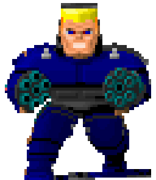
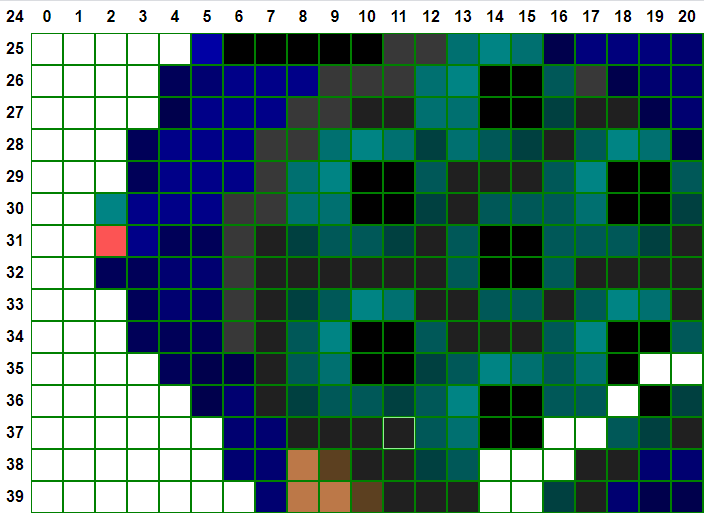
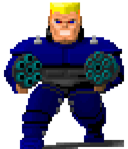

Reading Sprites 2: Wolfenstien
==============================

To round out the recent support for Wolfenstien 3D we'll look at the sprites.

Sprites in Wolfenstien 3D are in a very strange format.  Using the offsets that we got from the `VSWAP` header we can jump to the location in the file where they reside.  Everything above the `spriteStart` and below the `soundStart` is a sprite.  The sprite starts with a header:

```
startColumn (16-bits)
endColumn (16-bit)
columnOffsets ((endColumn - startColumn) * 16)
```

All sprites in Wolf3D are 64x64 pixels.  This is unlike Doom and ROTT which are variable sized but have some offset information to position them.  Small sprites will have a lot of transparent padding.  However to save some bytes they aren't stored as a 64x64 bitmap.  Sprites have a starting left column and an ending right column and that's what the first two values `startColumn` and `endColumn` (or as I'll call them in the code `left` and `right`) indicate.  Following those, is a list of 16-bit offsets and there are as many as there are columns plus 1 (so subtract left from right and add 1).

With this we can start the rendering.  We start at start column and loop to end column.  For each column, we take the offset from the start of the sprite and we will be pointed at a list of 6-byte drawing instructions.  The first 2 bytes is a 16-bit value representing the ending row index, we skip the middle 2, and the final 2 bytes is a 16-bit value representing the starting row.  Note that like with Doom image posts we can have multiple gaps, we continue to increment 6-bytes and read the next instruction, if the end row index is `0` then the column is complete and we move to the next one.

So then where is the pixel data?  Well, right below column offsets is an array of all the color indicies used in the sprite and there is 1 per colored pixel.  So as we draw the columns we take the next byte in the from this pixel pool and that is the palette index for that pixel.

The code: 

```js
export function loadSprite(asset){
	const dataView = asset instanceof DataView ? asset : new DataView(asset);

	let index = 0;
	const left = dataView.getUint16(index, true);
	index += 2;
	const right = dataView.getInt16(index, true);
	index += 2;

	const bitmap = allocBlockArray(64, 64);

	const columnOffsets = [];
	for(let col = left; col <= right; col++){ //less than or equal is important, see below
		columnOffsets[col] = dataView.getUint16(index, true);
		index += 2;
	}

	//index is now pointing at pixelPool

	for(let col = left; col < right; col++){
		let escape = 0;
		let offsetIndex = 0;
		while(true){
			 //we're reading 6 bytes and skipping the middle 2 bytes every time
			const end = dataView.getUint16(columnOffsets[col] + offsetIndex, true) / 2;
			if(end === 0) break;
			const start = dataView.getUint16(columnOffsets[col] + offsetIndex + 4, true) / 2;
			offsetIndex += 6; 
			for(let row = start; row < end; row++){
				bitmap[row][col] = dataView.getUint8(index);
				index += 1;
			}
			if(escape > 64) throw new Error(`Loop is not terminating. Column: ${col}`);
			escape++;
		}
	}

	return bitmap;
}
```

Note that I added a little error condition at the end.  When testing it's really easy to get an infinite loop and this will cause the tab to hang and UI to freeze.  After needing to close and reopen tab a few times, I added a sanity check so if we've read more than 64 instructions (which is impossible) we error out.  This is not technically needed in working code with correct assets.  The bitmap is rendered with the Wolfenstien palette as explained in the last part.



Guten Tag!

It seems to work, but there appears to be some weird artifacting going on with Mr. Grosse (chunk 406).  The edges have these tan looking pixels and there's a wierd outline on his head.  Let's start at the beginning to see what's going on:



So if we zoom into the first column we can see that there are 2 pixels don't really match the ones around it, especially the red one.  Could we have gotten the offsets wrong?  As it turns out, yes.  As I explained (and fixed) above, when we read the column offsets there is actually `(right - left) + 1)` columns (or as I actually do the loop condition `col <= right`, notice the "or equal to").  As far as I can tell the last column is not used, changing the column drawing loop seemed to have no effect.  What's interesting is that despite messing this up, the algorithm still gives us a mostly correct image, the colors are just shifted 2 pixels.  Weird.

Hans Grosse in his full glory:



And a guide for those following along at home: [Wolfenstien Chunk 406](https://ndesmic.github.io/webrott/visual-aids/wolf-chunk-406.html)

Aside: Position Sticky
------------------------------

While improving the visual aids with a cursor and legend I wanted the legend to be able to move so it doesn't block the part of the image you are looking at.  To do this, I wanted it to hover in the corner but have a button to switch sides.  I also wanted the legend the be visible on the screen even if the user needed to scroll down or it wouldn't be very useful.  You'd think `position: sticky` would work but it only does in the case of relatively positioned elements and I was using absolute positioning to place it in the corners.  After a few failed attempts that were getting too complicated I remembered that things can overlap in CSS grids.  So, instead of absolute positioning we place it in a grid column on either side and the table image spans 3 columns (the middle column is dynamic and takes up the remaining space).  Then, we need to place the legend in the sticky column container and set it to `position: sticky` and that works.  Sticky also doesn't work from the bottom, just the top, so when anchored to the bottom the legend has top `100vw - height - margin-bottom`.  There's also another problem, the sticky rail will capture events meaning we can't hover over pixels in that column.  To fix this, I used `point-events: none` on the rail but I also had to set `pointer-events: auto` on the legend to reset it so you can click the buttons.  The whole thing was not quite as straighforward as I thought. Just remember: CSS grids can be used instead of absolute positioning most of the time.

`position: sticky` is also not directly usable for `thead`s or `tr`s.  This is because they have a special type of position that's not relative.  You can unset the position but that's just a world of hurt to reconstruct them with CSS.  However, we can use `position: sticky` on `td`s which is what I did to make the horizontal ruler sticky.

Notes:
------

- There were several bugs in the last part that I had to go back and fix related to image orientation, I didn't notice it because walls are always squares but was very apparent when I started using sprites.
- I did the refactoring mentioned last time to use the intermediate format and negate the need for a component per image format so `doom-image`, `rott-wall` and `rott-image` have been removed.  Instead, we have `rott-asset.js` and `doom-asset.js` which have the decoding functions and all formats use `index-bitmap` to preview. 

Sources:
-------
- https://devinsmith.net/backups/bruce/wolf3d.html
- https://css-tricks.com/position-sticky-and-table-headers/