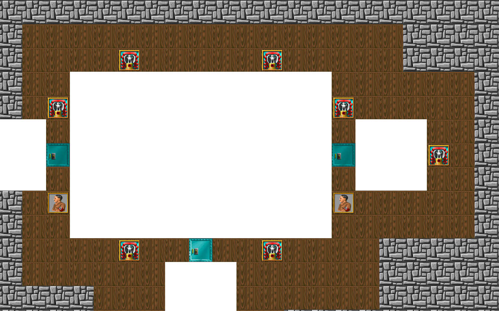
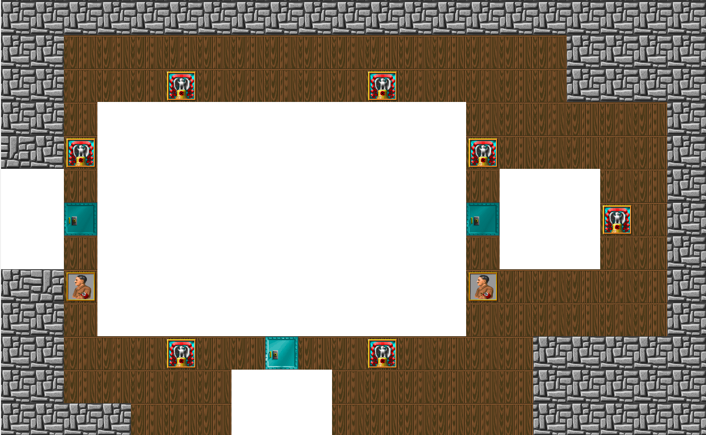
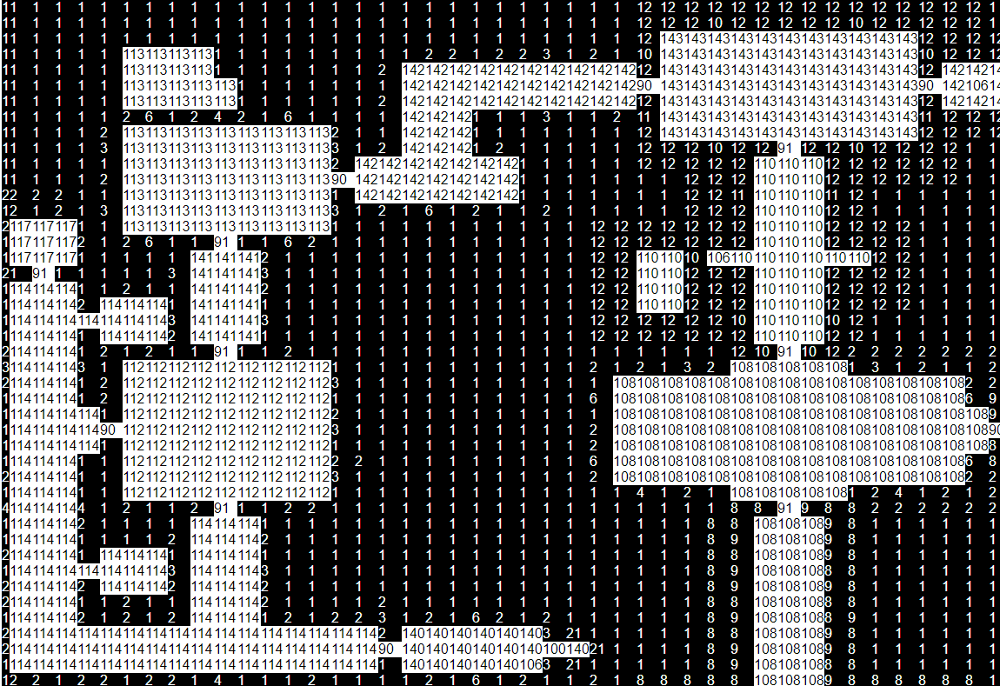

Reading Maps 4: Putting it Together
===================================

Swinging back around to rendering maps, it's now time to start combining things.  I think it makes sense to move maps into the `asset-viewer` rather than the other way around as the `asset-viewer` already needs to deal with several output types.  I think it might be nice to have some tabs to switch between content and maps, since we aren't using 3rd party libraries, we need to whip up a tab control.  There are a bunch of ways to do this including [pure CSS](https://ndesmic.github.io/nojs-lib/examples/tab/tab.html).  That's a little more tricky to deal with, so I'm just going to make a new custom element.

```js
export class TabSet extends HTMLElement {
	static get observedAttributes() {
		return [];
	}
	constructor() {
		super();
		this.bind(this);
	}
	bind(element) {
		element.cacheDom = element.cacheDom.bind(element);
		element.render = element.render.bind(element);
		element.attachEvents = element.attachEvents.bind(element);
		element.selectTab = element.selectTab.bind(element);
		element.tabClick = element.tabClick.bind(element);
	}
	connectedCallback() {
		this.render();
		this.cacheDom();
		this.attachEvents();
		this.selectTab(0);
	}
	render() {
		this.attachShadow({ mode: "open" });
		this.shadowRoot.innerHTML = `
				<style>
					:host { display: grid; grid-template-rows: [tabs] 2rem [tab-panels] auto; }
					#tabs { grid-row: tabs / tab-panels; display: flex; cursor: pointer; user-select: none; border-bottom: 1px solid #000; }
					#tabs ::slotted(*) { padding: 0.5rem; background: #efefef; display: flex; align-items: center; }
					#tabs ::slotted(.selected) { border: 1px solid #000; border-bottom: none; background: #fff; top: 1px; }
					#tab-panels { grid-row: tab-panels; }
					#tab-panels ::slotted(*) { display: none; padding: 0.5rem }
					#tab-panels ::slotted(.selected) { display: block; }
				</style>
				<div id="tabs">
					<slot id="tabs-slot" name="tabs"></slot>
				</div>
				<div id="tab-panels">
					<slot id="tab-panels-slot" name="panels"></slot>
				</div>
			`;
	}
	cacheDom() {
		this.dom = {
			tabsSlot: this.shadowRoot.querySelector("#tabs-slot"),
			tabPanelsSlot: this.shadowRoot.querySelector("#tab-panels-slot")
		};
		this.dom.tabs = Array.from(this.dom.tabsSlot.assignedNodes({ flatten: true })).filter(n => n.nodeType === Node.ELEMENT_NODE);
		this.dom.panels = Array.from(this.dom.tabPanelsSlot.assignedNodes({ flatten: true })).filter(n => n.nodeType === Node.ELEMENT_NODE);
	}
	attachEvents() {
		this.dom.tabsSlot.addEventListener("click", this.tabClick);
	}
	tabClick(e) {
		if (e.target.slot === "tabs") {
			const index = this.dom.tabs.indexOf(e.target);
			this.selectTab(index);
		}
	}
	selectTab(index) {
		const tab = this.dom.tabs[index];
		const panel = this.dom.panels[index];
		if(!tab || !panel) return;
		this.dom.panels.forEach(p => p.classList.remove("selected"));
		this.dom.tabs.forEach(p => p.classList.remove("selected"));
		panel.classList.add("selected");
		tab.classList.add("selected");
	}
	attributeChangedCallback(name, oldValue, newValue) {
		this[name] = newValue;
	}
}

customElements.define("tab-set", TabSet);
```

This is pretty much a minimal custom element tab control, you can even remove the attributes boilerplate.  Some interesting things if you haven't done any deep diving into slotted components: `::slotted` is a selector for the content within the slot.  Note that it modifies what's inside the parens, it's not a modifier itself so `slot div::slotted()` doesn't work like you might think.  The other part is `assignedNodes`.  This gets the nodes that are in the slot. Slotted elements don't actually exist in the slot's `childNodes` so you can't query for them with `document.querySelector`.  We need to convert them to an array (because they are a `NodeList` not an array) and we want to remove any text nodes because if you used any space they will get in there and mess up the index.  We cache these arrays upfront because we'll be referring to m a lot.  There's a lot of ways you can modify this including the very barebones styling and a lot of edge cases that will fail, for example adding new tabs after the fact because we cached the list.  You will likely want to modify a bit if you want to copy/paste the code for you own projects.  Custom elements make using it is pretty easy:

```html
<tab-set>
	<div slot="tabs">A</div>
	<div slot=tabs>B</div>
	<div slot="tabs">C</div>
	<div slot="panels">A Content</div>
	<div slot="panels">B Content</div>
	<div slot="panels">C Content</div>
</tab-set>
```

I've created a new folder called `docs`.  This will house documentation for components.  I find this is a good way to work because it's easy to make changes to a component without testing it directly in `asset-viewer` and serves as documentation, not just for users but for myself when I inevitably forget how to use my own component.  As necessary I might add readmes, but this is a pretty simple component right now.

Next, we'll need to modify the types of files we take in and try to make sense of it.  There's a lot refactoring going on in `asset-reader`.  Lots of code deduping now that we have a better idea of how things will work.  For one, we're now taking in a list of files and just appending them, this way we read every asset the user inputs and don't have to make assumptions about what the selected files represent in terms of games.  I've also given up on limiting the mime-types in the file selector for now.  Also, I've made some slight changes with how custom elements are exported.

Before:

```js
customElements.define("custom-element",  class extends HTMLElement { ... });
```

After:
```js
export class CustomElement extends HTMLElement { ... };
customElements.define("custom-element", CustomElement);
```

This is because instead of using a side-effect imports `import "custom-element.js"` and then using `document.createElement("custom-element")` which isn't obvious to trace back we can use the constructor `new CustomElement()`.  Much cleaner.  Other small performance things: entries are also appended via document fragments which cause less layout thrashing, and making more use of dynamic imports so the user doesn't pay the cost of loader code for things they aren't using.  We can now throw away the `map-reader` component.

Walls
-----

To update the map preview I pretty much rebuilt it in the style we've been doing.  It takes the list of walls (every chunk up until `spriteStart` for Wolfenstien) converted into a bitmap, the palette, and the map layer data.  Then it's just a matter of mapping the value at each grid location to a wall and drawing it.  As we learned before values 0-64 are walls.  These map near directly to wall indicies, however they are 1-indexed (I first assumed 0-indexed and got some weird results).  So that `(value - 1) * 2` gets you the chunk index from the vswap.  Why multiply by 2?  This is because as noted when were previewing walls every wall has 2 variants a normal and a darker one and they are always next to each other in the list of chunks.  The darker variant is for walls rendered East to West to give faux shadowing.  This needs to be dynamically handled in game as we don't know which face of a wall we are looking at.  For our top-down view we'll just pick the normal variant for all walls.

Doors
-----

Doors are placed oriented so you know which way to pass through them.  Remember there are 3 types, normal, elevator, locked.  There's also 2 more lumps for the door frame which is drawn as a special case on the inner parts of the walls the door sits between.  In order to find which texture we need to render for the door, we have to look backward from the end of the walls segment.

- wallCount - 0: Locked Door (E/W)
- wallCount - 1: Locked Door (N/S)
- wallCount - 2: Elevator Door (E/W)
- wallCount - 3: Elevator Door (N/S)
- wallCount - 4: Door Rails (E/W)
- wallCount - 5: Door Rails (N/S)
- wallCount - 6: Door (E/W)
- wallCount - 7: Door (N/S)

We need to do the backward lookup because the number of walls will change based on the vswap for that version.  For instance, the registered version with nocturnal missions has 106 wall textures.  The final shareware has 106 and seems to keep the same indices with unavailable walls simply reporting offset and length 0.  But v1 shareware uses 64 textures so the final indicies are different.

Now that we can see the maps better let's check out what the weird difference was in the v1 version of the shareware:

Version 1:


Final Version:


So it looks like they extended the wooden wall past where it was supposed to be.  Interesting.

If you started to play around with the map preview, you've probably noticed it'll freeze the UI for several seconds.  This is bad and it's because we are being incrediably naive by rendering 4096 canvas elements into a table.  It works for now but we definitely want to fix that.

By the way, as a bonus, it handles cases where no `VSWAP` is passed in with the map:



Sources:
-------
- http://gaarabis.free.fr/_sites/specs/wlspec_index.html