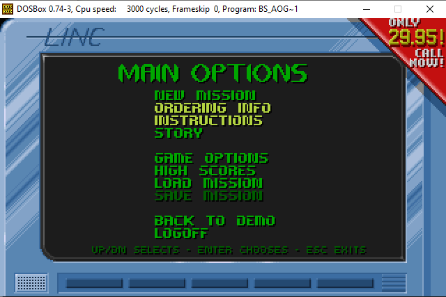

Reading palettes 2: EXE Compression, Binary Diffing, and palette Sniffing
=======================================================================

The last part was getting rather long so I decided to end without having a 100% working UNLZEXE utility.  While most of the code was working and it could generate output, the output file was about 2x the expected size.  After mindlessly watching the debugger through about 400 cycles of LZ decompression and getting good results, I felt it was time to find another way to go about this.

The idea is to build a simple binary file diff tool.  This way I can compare to the decompressed file I got with `UNLZEXE` and see where mine starts going off the rails.  Not all of the parts are wrong, so if I can find out where they start diverging I can work back and try to find that part of the source and set some break points to figure out what's going on.

The idea is pretty simple.  Read in two files and compare the lengths.  This will easily tell if they are different but more info is needed.  So we'll walk through each file, byte by byte looking for differences.  Since we expect a lot of them, I'm going to limit how many are printed with an attribute on the custom element.

The output looks like this:


This is okay but I'd like to be able to spot the differences without having to manually dig through the hex editor.  We know some of the headers are going to be messed up because we're not terminating the decompression correctly so we can skip those.  Also, I suspect that some of these could be offset errors in which case all bytes are simply wrong because the position is wrong.  To catch that we'll need to improve the output slightly.  I think what might make sense is more of a hex editor interface.  We'll keep the restrictions on the number of diffs though, simply because 100,000 cells in a table is going to cause problems. (We could show everything and do some virtualization and perhaps this is a topic for the future)

Here's the result:


So now we start tackling the bugs:

1) We returned `return new Uint16Array(...tableBody);` at the end of makeRleTable.  Whoops, it takes an array in parameter 1, so we change this to `return new Uint16Array(tableBody);`
2) I thought I could increase understandibility by expanding the bitmasks, as it turns out `0b11110000` is not quite `~0x0f`, if the comparison is greater than an 8-bit value it's incorrect.  In this case I decided `~0x0f` was better even if it reads terribly because I don't have to think about the length.  However, expanding to a 16-bit binary mask might solve most of the problems too.
3) When the data portion is returned, I return it as  `Uint16Array(outBody)`.  In this case, `outBody` was actually 8-bit values so we need to convert back to 16-bit values `Uint16Array(new Uint8Array(outBody).buffer)`.
4) We got the `minAlloc` and `maxAlloc` wrong.  I had to consult a different implementation to get these.  The final code is:
```js
decompressedHeader.minAlloc = dosHeader.maxAlloc !== 0
	? dosHeader.minAlloc - (compressionInfo.increaseLoadSize + ((compressionInfo.sizeOfDecompressor + 16 -1) >> 4) + 9)
	: dosHeader.minAlloc;
decompressedHeader.maxAlloc = dosHeader.maxAlloc !== 0
	? dosHeader.maxAlloc !== 0xffff 
		? dosHeader.maxAlloc - (dosHeader.minAlloc - decompressedHeader.minAlloc)
		: dosHeader.maxAlloc
	: dosHeader.maxAlloc;
```  
It seems as though less is allocated for the final `minAlloc` because the compressor code doesn't need to be in memory.  What I don't understand is the `16 - 1` or why we add 9.  But it works.  This should cancel out the `minAlloc` from `dosHeader` and give the expected value `0`.
Likewise for the `maxAlloc` is the original `maxAlloc` minus what we calculated above.  However, if the value is set to the max value `0xffff` or min value `0` we just carry it use that instead.  For `BS_AOG.exe`, it's set to the max value `0xffff`.

And with that we have identical files!  As a final test let's try it out in dosbox.



UNLZW.exe is successfully ported to the web, no more native binaries! (Well almost, I didn't implment LZ90 because I have no test cases).  There's probably some bugs too but now we can start peeking through the compiled code for Blake Stone.

[You can find the UNLZEXE utility here](./tools/unlzexe.html)

Finding the palette
------------------

Finding the palette is a hard task.  At first I started with my naïve idea to search for 0,0,0 to find the color black.  There are now way too many entries to look for, especially with empty padding bytes so we need to try something different.

Attempt 2 was finding 3 length sequences of repeating bytes (e.g. gray colors).  This was done by creating a sliding window of length 9 and asserting that we had 3 triplets of different values.  Each step one byte is shifted from the start, and push onto the end.   This got me closer and I found a couple pieces of data that looked reasonable but if I find one where does it start? Where does it end?  I can't be sure I even found the right thing.  

Attempt 3 was to find an entire palette.  We know a palette is 768 bytes long, all of them less than 64, and no triplets should repeat.  This is a much slower algorithm.  It also doesn't work.  What I found is that colors *can* repeat (you'd think with only 256 colors they wouldn't...).  This is the case for some of the gray colors (color 16 is the same as 160).  In the end, what I found is that Blake Stone shares the very same transparency color with Wolfenstien.  After some manual searching for this color `38,0,34` (luckily there's only a couple of matching sequences) I found buried in the end section of the EXE with the static strings. That should be the end of the palette so we look back 768 bytes and the first color, as expected is `0,0,0`.  And that's how the palette extractor now works.  It finds a 768 byte window where values all less than 64, with beginning `0,0,0` and end `38,0,34`.  It now works on unpacked Wolfenstien 3D EXEs (The UNLZEXE utility worked for that too!), `gamepal.obj` and `BS_AOG.exe` so it's good enough.

What does the palette look like?


Let's add it to the asset loader (this will be pushed to part 15) and see our new sector patrol guard sprite:


That was a lot of work to get such a tiny piece of data, but it sure feels good.  We also are armed with some new knowledge and couple new tools that might come in handy later.

[You can find the palette extractor here](./tools/palette-extractor.html)

If you want a guide for Blake Stone chunk 287 look here: [chunk 287](./visual-aids/blake-chunk-287.html)

Souces
------
- https://github.com/mywave82/unlzexe/blob/master/unlzexe.c