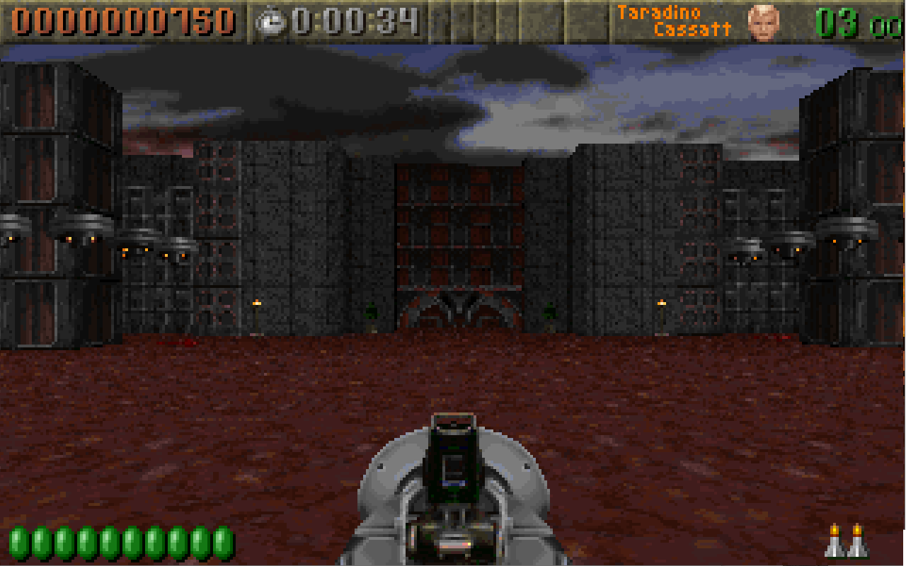

Reading Maps 5: ROTT Textures
=============================

So first thing is let's try to load up a Blake Stone map.  A few things go wrong.  Maps are still 64 x 64 but I noticed that this is hardcoded even when we have the map height and width.  So fix that.  Blake Stone as it turns out doesn't have 3rd map layer and we can tell because the length is given as 0.  So we need to handle that so the layer decompression routine doesn't blow up.  This just means reading the offsets, filtering out and entries of 0 and then taking the length.  While Blake Stone still hardcodes 3 layers the loop is easily updated to handle arbitrary numbers of layers.  We also hardcoded the Wolfenstien palette so we need to update that.  We just need to add a method `setpalette` to the `GameMaps` class (the same way we do for `index-bitmap` to show sprites) and so when rendering the map we check if the extension matches Blake Stone, otherwise we default Wolfenstien.  Easy fixes and we have Floor 1 of Blake Stone: Aliens of Gold (or at least as much of it as I can fit for a screenshot, if you played it you know where this is):


# Rise of the Triad

At some point this blog was about Rise of the Triad.  Let's get back to that and see how much we can render.  It seems like when we optimized the map loading we lost our "walless" rendering.  So let's restore that and then pipe the RTL file layers into a `ted-map`.


Too zoomed in to tell exactly what we are looking at but at least we have it running through `ted-map`.  Next let's try to get the walls.

ROTT defined a constant for the number of walls called `MAXWALLTILES` which is set to 105.  There are 105 structs that look like this:

```c
//RT_TED.H line 62
typedef struct
{ thingtype   which;
  byte        flags;
  byte        hitpoints;
  word        tile;
  byte        tilex,tiley;
} wall_t;
```

It's not clear what all this means yet.  But tracing some stuff back we find `GetLumpForTile` in the source and it looks like this:

```c
//RT_TED.C line 4170
int GetLumpForTile(int tile)
   {
   int wallstart;
   int exitstart;

	wallstart=W_GetNumForName("WALLSTRT");
	exitstart=W_GetNumForName("EXITSTRT");
	elevatorstart = W_GetNumForName("ELEVSTRT");

   if ((tile >= 1) && (tile <= 32))
      {
      return (tile + wallstart);
      }
   else if ((tile >= 36) && (tile <= 45))
      {
      return (tile + wallstart - 3);
      }
   else if (tile == 46)
      {
      return (wallstart + 74);
      }
   else if ((tile >= 47) && (tile <= 48))
      {
      return (tile + exitstart - 46);
      }
   else if ((tile >= 49) && (tile <= 71))
      {
      return (tile + wallstart - 8);
      }
   else if ((tile >= 72) && (tile <= 79))
      {
      return (tile - 72 + elevatorstart + 1);
      }
   else if ((tile >= 80) && (tile <= 89))
      {
      return (tile + wallstart - 16);
      }
   return -1;
}
```

If we look at the first condition we see that tiles < 32 simply map to their wad offset.  Try this out and here's the first fire wall hallway of The Hunt Begins:


Eh, that's not right.  Because we start at 1 we need to subtract 1 from the asset index:


So this is kinda right but still weird.  Let's compare to what we see when playing in DOSBOX:

The first room looking north toward the door to hallway 1:

Looking north from the entry door in hallway 1:

Looking north-east at the back of hallway 1:


The metal panel texture does look like it's in the right place.  At the back of this hallway is a triad logo with 2 slatted metal panels, this looks correct.  The bricks are not the right texture, in game they look like texture 45.  The door is wrong (this is somewhat expected since it's a special case) and the fire walls have disappeared.  Let's also look at the no texture mode:


Well it's clear what happened.  These walls have indicies greater than 32 so checking the code above it appears we have to do some weird offsetting even though we expected these to be "normal" textures.  Defintinely not as intuitive as Wolfenstien.  There's a lot going on.


## Doors

Walls cover a few ranges and there seem to be 20 total door types.  We can find these in `SetupDoors` in `RT_TED.c` but we can also trace that into `SpawnDoor` in `RT_DOOR.c` to find the textures used.

- 33 (15 "SNDOOR")
- 34 (16 "SNADOOR")
- 35 (17 "SNKDOOR")
- 90 (0, "RAMDOOR1")
- 91 (1, "DOOR2")
- 92 (2, "TRIDOOR1")
- 93 (3, "TRIDOOR1")
- 98 (8, "RAMDOOR1") 
- 99 (9, "DOOR2")
- 100 (10, "SDOOR4")
- 101 (11, "SDOOR4")
- 102 (12, "EDOOR")
- 103 (13, "TRIDOOR1")
- 104 (14, "SDOOR4")
- 154 (18, "TNDOOR")
- 155 (19, "TNADOOR")
- 156 (20, "TNKDOOR")

33-35 form the "Snake" door which is a 3 part door.  Unlike Wolfenstien doors can span multiple tiles. Same with 154-156 and "TN" (no clue what this stands for) door.  Doors assets have an interesting image setup.  If you had previously tried to open these in the asset loader, it would have crashed on some of them.  Each door has 8 frames of animation plus a default.  The default image is a 64x64 bitmap, the animation frames are ROTT's Doom Image variant (eg they have "holes") so they need to be loaded differently.  Typically, the animation frames are suffixed A-H and the default has no letter, except for `TRIDOOR` and `RAMDOOR` which are suffixed 1-9 with 1 being the default.  I added some regexing to the asset loader to account for this but it's pretty annoying, there's no way to be sure what type we have based on the name alone.  You might even try to be clever and look at the file size since 64x64 bitmaps are always 4096 bytes but `SDOOR4A` is exactly that size as well.  The only real way to know is by reading the whole WAD.  Doors appear between the marker lumps `DOORSTRT` and `DOORSTOP` and every 9th asset is the default.

Strangely there are 20 indexed doors but only 11 indices are used, some map to the same door and indices 3-7 are simply left out.  Perhaps a casualty of development.  For the shareware version this leaves us with exactly 6 types of doors.

This gets pretty complicated to add to the map renderer.  The first thing we need to do is grab all the door textures, and since our tiled images only take a tile map and a list of tiles we nee to lump them together with the walls.  However, due to the complex mapping above we need to be able to reduce these down to the indices 1-6 then we'll then append them to the end of the list and add the offset of the number of wall assets.  This is important because I think the registered version has more walls and doors.  So instead of a list we extract a list of entries:

```js
export function extractStaticDoorEntries(wad) {
	let isDoors = false;
	const doors = [];
	for (let i = 0; i < wad.entries.length; i++) {
		const entry = wad.entries[i];

		if (entry.name === "DOORSTOP") break;
		if (isDoors) {
			if (entry.size == 4096 && entry.name != "SDOOR4A") { //pretty hacky but at least there's only a few doors and this is the only case where size is 4096 and it's not a 64x64 bitmap image
				const door = new DataView(wad.arrayBuffer, entry.offset, entry.size);
				doors.push([trimString(entry.name), loadWall(door)]);
				i += 8; //skip animation frames
			}
		}
		if (entry.name === "DOORSTRT") isDoors = true;
	}
	return doors;
}
```

This is because in addition to the asset, we want to know the index and the name.  Then when we are assembling the tile map, we first use a bunch of ifs to get the door index (0-20), convert that to a lump name, then use the lump name to index into the map of actual wall textures (0-5 for shareware) and finally add the count of wall textures to get the index into the tile list.  \*exhales\*

`loadMap` now looks like this:
```js
export function loadMap(map, wallTextureCount = 105, doorTextureMap) {
	const height = map[0].length;
	const width = map[0][0].length;
	const tileMap = allocBlockArray(height, width);

	for (let row = 0; row < height; row++) {
		for (let col = 0; col < width; col++) {
			const value = map[0][row][col];

			if(value >= 1 && value <= 32){
				tileMap[row][col] = value - 1;
			} else if(value >= 33 && value <= 35){ //snake door
				tileMap[row][col] = wallTextureCount + doorTextureMap[doorIndexToName((value - 33) + 15)];
			} else if(value >= 36 && value <= 45){
				tileMap[row][col] = value - 4;
			} else if(value === 46){
				tileMap[row][col] = 73;
			} else if (value >= 49 && value <= 71) {
				tileMap[row][col] = value - 9;
			} else if (value >= 80 && value <= 89){
				tileMap[row][col] = value - 16;
			} else if (value >= 90 && value <= 104){ //doors
				tileMap[row][col] = wallTextureCount + doorTextureMap[doorIndexToName((value - 90))];
			} else if (value >= 154 && value <= 156){ //doors
				tileMap[row][col] = wallTextureCount + doorTextureMap[doorIndexToName((value - 154) + 18)];
			}
		}
	}

	return tileMap;
}
```
With the hardcoded index-to-lump-name:
```js
function doorIndexToName(value){
	switch(value){
		case 0:
		case 8:
			return "RAMDOOR";
		case 1:
		case 9:
			return "DOOR2";
		case 2:
		case 3:
		case 13:
			return "TRIDOOR1";
		case 10:
		case 11:
		case 14:
			return "SDOOR4";
		case 12:
			return "EDOOR";
		case 15:
			return "SNDOOR";
		case 16:
			return "SNADOOR";
		case 17:
			return "SNKDOOR";
		case 18:
			return "TNDOOR";
		case 19:
			return "TNADOOR";
		case 20:
			return "TNKDOOR";
		default:
			throw new Error(`Door index ${value} does not coorispond to a ROTT door asset.`)
	}
}
```
And we just need to assemble the asset-name-to-index in `asset-reader.js`: `const doorIndexMap = Object.fromEntries(doors.map(([key, value], index) => [key, index]));`

After multiple layers of mapping we have what we want.  Door textures:


So we have wall texture and door textures. ROTT has a lot more going on though, we're not even finished with layer 0.  We still need to figure out push walls, wander walls, and masked walls.

For reference, I've create a table of the values found in layer 0 and what they mean: [rott plane 0 tiles](./appendix/rott-plane0-tiles.md)


Note on File Conventions
------------------------

As I work I'm starting to see the limitations of my file naming convention.  I've renamed things to have more of a common convention. Until I find a better one, to keep things straight the idea is this:  `{game}-asset.js` are high-level functions unique to a particular game, they may call into the mid-level `{wad/ted}-asset.js` which has things that are common to TED or WAD files.  Finally, `rott-map-file` (formerly `rtl-file` but that was a bad convention due to RTC files), `ted-file` and `wad-file` (formaly `wad`) are for raw entry extraction and file metadata, and they are always suffixed with "File" and can be directly used by anything down the chain.


Aside: Bugs
-----------

I spent about an hour pulling my hair out because the map would constantly autoscroll to the left and lists would not scroll properly.  I first thought it was a browser quirk but it happened in Firefox as well.  Then I assumed it was a stuck mouse button but using another mouse caused the same thing.  Then I noticed it happening in some other apps.  I unplugged my keyboard, still scrolling.  I tried out the asset-reader on another computer and it worked.  I rebooted and it still didn't.  Ultimately, the culprit was a bluetooth adaptor.  Yeah, apparently it can get stuck...across reboots.  Who knew?  Unplugging and plugging it back in fixed it.  Sometimes those bugs you find can come from the weirdest places.

Aside: Custom Element Loading States
------------------------------------

The `table-pic` component used by the visual aids had a visual flaw when loading.  Since this takes non-trivial time to download and parse it would flicker as the element started in a compressed state and then expanded to the loaded image.  This is easy to fix.  We just need to start with a `display: none` on the `:host`, and then at the end of loading we add a class `hydrated` to the `:host` and set `:host(.hydrated)` back to the display value we want.  This isn't fool-proof as it can still cause layout instability as it pushed things around (we'd need to precalculate the size to fix that) but for a simple page with no elements this works just fine. 