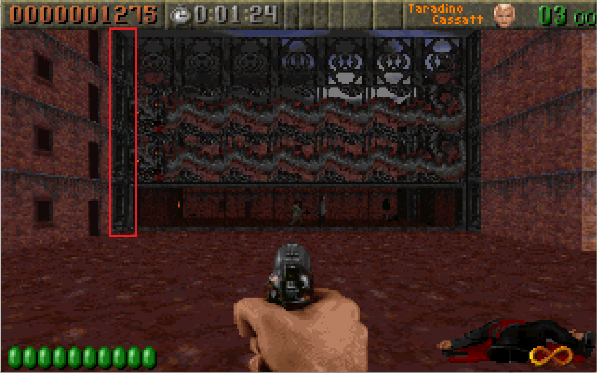
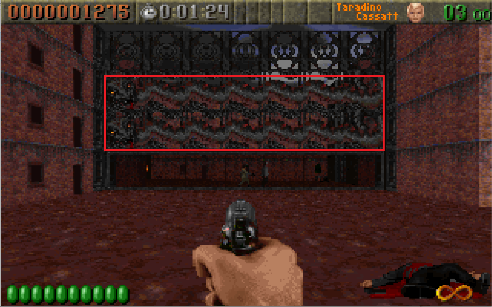
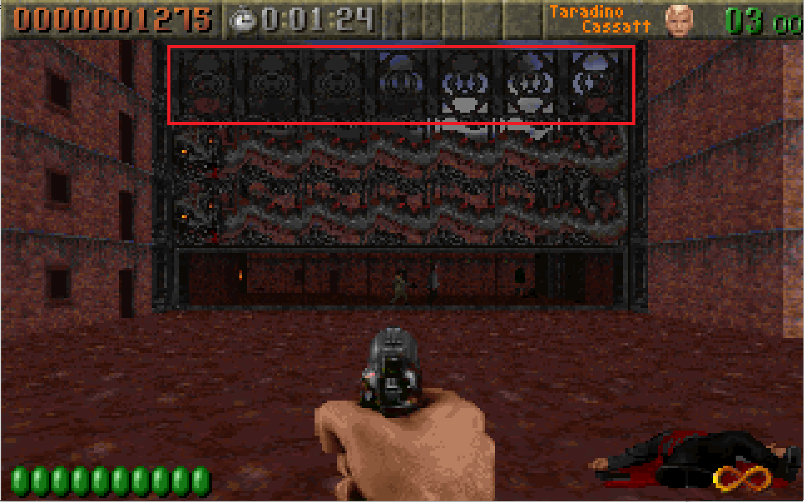
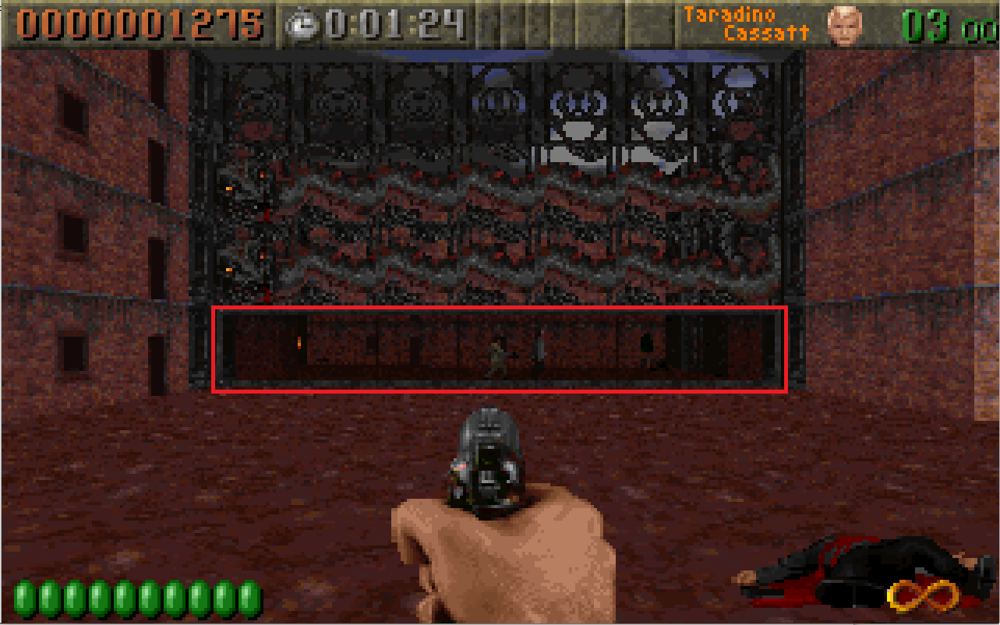

Walls 4 - Masked Walls
======================

First I cleaned up the UI a little bit.  One of the nagging problems was that the list of assets was the same size as the preview window, which didn't make sense.  I updated it with the `split-panel` control.  This is also built from scratch though I've pulled the details out into it's own [blog post](https://dev.to/ndesmic/how-to-make-a-resizable-panel-control-with-web-components-2cpa).  Now the spacing makes more sense and you can resize the panels, much better!

# Masked Walls

These are defined on `RT_TED.c` line 2637, function `SetupMaskedWalls`.

What happens when we find a masked wall is found in `RT_DOOR.c` line 2090 `SpawnMaskedWall`.  There are a number of different types and these are defined as sections in the WAD.  Note not all of them have section ending markers.

- High Mask assets appear after `HMSKSTRT`
- Mask assets appear between `MASKSTRT` and `MASKSTOP`
- Above Mask assets appear after `ABVMSTRT`
- Side Walls appear between `SIDESTRT` and `SIDESTOP`

The object created has the following struct:
```c
//RT_DOOR.H line 157
typedef struct mwall
{
  thingtype      which;
  byte      tilex,tiley;
  signed char areanumber;
  signed short toptexture;
  signed short midtexture;
  signed short bottomtexture;
  word      flags;
  boolean   vertical;
  int       sidepic;

  struct mwall *next;
  struct mwall *prev;

} maskedwallobj_t;
```
Where `thingtype` is:
```c
//RT_DEF.H line 227
typedef enum
 {SPRITE,
  WALL,
  ACTOR,
  DOOR,
  PWALL,
  MWALL
 }
 thingtype;
```
When SpawnMaskedWall is called, it creates a `maskedwallobject_t`, adds it to a list of maskedwallobjects with a `thingtype` `MWALL`.  It then places the index of the object at the desired x, y OR'd with 0xc000 (top 2 bits on) in tilemap plane 0 so it can be referenced.  It then tries to figure out the orientation of the wall.  To do so it checks the cardinal directions. If the direction contains a masked wall, it associates with that direction value `2`, if it's a regular wall `1` otherwise `0`.  If two sides of the masked wall contain walls (`1` or `2`) then it orients the masked wall to span between them (eg up=1 down=1 then it's vertical, imagine a pane of glass stretching between 2 walls north to south).  If it has trouble placing things, the priority is walls, masked walls, and then having a single bordering wall vertical, then horizontal.  Then it reads the sides of the masked wall, so in the case of a vertical pane of glass, we want the right and left.  These should be areas. 

"Areas" in ROTT are anything in the wall plane (0) that have a value greater than or equal to `107`.  Areas are open space, but the value acts as an identifier to calculate line of sight and sound propagation.  For example, if I shoot a weapon in an area, all enemies in that area should be alerted.  For masked walls, we need to connect 2 areas.  So if area 1 is on the left and area 2 is one the right, enemies in area 2 should be able to see and hear what goes on in area 1 if the mask wall is a rod iron fence.  The connections are stored in a 2d array lookup table (hardcoded size 47) and the lookups are bidirectional so there is entry 1->2 and 2->1.  These are stored as integers, not booleans.  This is because it's possible to have multiple connections between areas, say a glass wall and a door.  So for each entry we increment by 1.  This really comes to play with doors as an open door contributes +1 but a closed door contributes 0.  In the case of a masked wall, the connection is always open so we increment it by 1 and it will never decrement.  As long as the connection value is greater than 0, the areas are connected.

It then checks if layer 2 contains a value `1` or `4-9` and layer 0 contains `21`.  This indicates the platform is a metal platform (more on this later).  Then we get to the interesting part, the type of masked wall.  Each wall has 4 textures: side, middle, above, bottom.  There's a bunch of ifdefs to downgrade textures for shareware but we can ignore that for now.

## Textures

First let's start with what these different textures refer to.  Here's a type of masked wall from Map 1 of The HUNT Begins:

### Side


The side texture is what replaces the face of the ajoining walls, usually because the masked wall is inset inside a block.  This is an extension to how Wolfenstien 3D uses textures for the door insets.

### Middle


The middle texture is what spans between the above and bottom texture.  It will stretch with the map height.

### Above


The above texture is 1 wall height unit at the top of the wall.

### Bottom


The bottom texture is 1 wall height unit at the bottom of the wall


### Wall Types

| Value | Type | Side | Middle | Above | Bottom |
|-------|------|------|--------|-------|--------|
| 0 | mw_peephole | SIDE21 | ABOVEM4A | ABOVEM4 | PEEPMASK |
| 1 | mw_dogwall |  SIDE21 | ABOVEM9 | ABOVEM4 | DOGMASK |
| 2 | mw_multi1 | SIDE21 | ABOVEM5A | ABOVEM5 | MULTI1 |
| 3 | mw_multi2 | SIDE21 | ABOVEM5B | ABOVEM5 | MULTI2 |
| 4 | mw_multi3 | SIDE21 | ABOVEM5C | ABOVEM5 | MULTI3 |
| 5 | mw_singlepane | SIDE21 | ABOVEM4A | ABOVEM4 | MASKED4 |
| 6 | mw_normal1 | SIDE21 | ABOVEM4A | ABOVEM4 | MASKED1 |
| 7 | mw_normal2 | SIDE21 | ABOVEM4A | ABOVEM4 | MASKED2 |
| 8 | mw_normal3 | SIDE21 | ABOVEM4A | ABOVEM4 | MASKED3 |
| 9 | mw_exitarch | SIDE21 | ABOVEM4A | ABOVEM4| EXITARCH |
| 10 | mw_secretexitarch | SIDE21 | ABOVEM4A | ABOVEM4 | EXITARCA |
| 11 | mw_railing | none | -1 | -1 | RAILING |
| 12 | mw_hiswitchon | none | `himask+1` | `himask+3` | `himask` |
| 13 | mw_hiswitchoff | none | `himask+1` | `himask+2` | `himask` |
| 14 | mw_platform1 | none | -1 | `himask+10`, if metal=true then `himask+15` | -1 |
| 15 | mw_platform2 | none | -1 | -1 | `himask+8`, if metal=true then `himask+14` |
| 16 | mw_platform3 | none | -1 | `himask+10`, if metal=true then `himask+15` | `himask+8`, if metal=true then `himask+14` |
| 17 | mw_platform4 | none | `himask+7`, if metal=true then `himask+15` | `himask+7`, if metal=true then `himask+15` | `himask+12`, if metal=true then `-1` |
| 18 | mw_platform5 | none | `himask+7`, if metal=true then `himask+15` | `himask+5`, if metal=true then `-1` | `himask+12`, if metal=true then `-1` |
| 19 | mw_platform6 | none | `himask+7`, if metal=true then `himask+15` | `himask+5`, if metal=true then `-1` | `himask+4`, if metal=true then `himask+14` |
| 20 | mw_platform7 | none | `himask+7`, if metal=true then `himask+15` | `himask+5`, if metal=true then `-1` | `himask+4`, if metal=true then `himask+14` |
| 21 | mw_entrygate | SIDE21 | ABOVEM4A | ABOVEM4 | ENTRARCH |

Some of the values here are special.  `-1` indicates that there is no texture, you can see through it.  Some are not directly indexed by name but rather an offset from the WAD section marker. "none" means `sidepic=false`.  `sidepic` is true by default but turned off for some masked walls indicating they do not have a side texture.  Some textures change depending on if the info layer said it was metal. `mw_platform2` and `mw_platform3` have a low tunnel, if the value was not metal (explained above) it gets `MW_BOTTOMFLIPPING` set in its flags. `mw_platform5`, `mw_platform6` and `mw_platform7` have a high tunnel, if the value is not metal, it gets `MW_TOPFLIPPING` set in its flags.  `mw_platfrom7` is identical 2 `mw_platform6` except it errors if not bordered by 2 walls.  If `mw_multi1`, `mw_multi2`, `mw_multi3`, `mw_singlepane`, `mw_normal1`, `mw_normal2`, `mw_normal3` are not marked as shootable, `+9` is added to their bottom texture index.

If the wall has a side texture then we look for our support walls (vertical or horizontal) and OR them by `0x4000`.

The textures for the walls are then precached which we don't need to worry about since we comparitively have all the RAM in world.

## Flags

So what do all those flags mean?

| Value | Name | Description |
|-------|------|-------------|
| 0x01 | MW_SHOOTABLE | Wall will absorb bullets |
| 0x02 | MW_BLOCKING | Wall will block player |
| 0x04 | MW_MULTI | The wall will reflect changes of adjacent walls |
| 0x08 | MW_BLOCKINGCHANGES | The blocking status of wall can change |
| 0x10 | MW_ABOVEPASSABLE | Can pass through top of wall |
| 0x20 | MW_NONDOGBLOCKING | Wall blocks movement except when dog  |
| 0x40 | MW_WEAPONBLOCKING | Objects cannot shoot through wall |
| 0x80 | MW_BOTTOMPASSABLE | Can pass through bottom of wall |
| 0x100 | MW_MIDDLEPASSABLE | Can pass through middle of wall |
| 0x200 | MW_ABP | Wall activates and de-activates |
| 0x400 | MW_SWITCHON | High switch is in on position |
| 0x800 | MW_BOTTOMFLIPPING | Player can see through bottom |
| 0x1000 | MW_TOPFLIPPING | Player can see through top |

Most of these make sense when you apply them to the actual masked wall values in plane 0:

| Value | Name | Flags |
|-------|------|-------|
| 158 | Glass Wall 1 | Muli, Blocking, Blocking Changes, Shootable |
| 159 | Glass Wall 2 | Muli, Blocking, Blocking Changes, Shootable |
| 160 | Glass Wall 3 | Muli, Blocking, Blocking Changes, Shootable |
| 161 | Pillar (removed from code) | Blocking |
| 162 |  | Shootable, Blocking |
| 163 |  | Blocking |
| 164 |  | Shootable, Blocking |
| 165 |  | Blocking |
| 166 |  | Shootable, Blocking |
| 167 |  | Blocking |
| 168 |  | Shootable, Blocking Changes |
| 169 |  | Bottom Passable |
| 170 | Dog Door | NonDog Blocking, Weapon Blocking |
| 171 | Peephole | Weapon Blocking, Blocking |
| 172 | Exit Arch | Bottom Passable |
| 173 | Secret Exit Arch | Bottom Passable |
| 174 | Entry Gate | Blocking |
| 157 | Hi Switch Off | Blocking |
| 175 | Hi Switch On | Blocking, Switch On |
| 176 | Shot-out Glass Wall 1 | Bottom Passable |
| 177 | Shot-out Glass Wall 2 | Bottom Passable |
| 178 | Shot-out Glass Wall 3 | Bottom Passable |
| 179 | Railing | Above Passable, Middle Passable |

Glass absorbs bullets but then breaks becoming passable, Dog doors allow dogs but no-one else (not even weapon projectiles), arches block the top but not the bottom, switches can be on or off.  There's also entry 161 which is a pillar and is commented out from the code, I guess this was an early implementation before they decided to go with sprites.


# Implementing Masked Walls

We now know what they do, but there's not a lot to implement at this point, not without more of the game engine completed.  For now, let's try to draw them.  As it turns out we have a mess of image formats to untangle.

## Sides

There are only a handful of sides and they are all in wall format (64 x 64 bitmap)

## Above Mask, Bottom Mask, Middle Mask

Trying to load these we find that most work but some (like `HISWITCH1`) will fail.  As it turns out, these are not all rott-images (or as the source calls them `patch_t`s), but rather translucent rott-images (or at the source calls them `transpatch_t`s).  What this means is we have another value that snuck into the header, the translucentcy level, and this comes just before the list of post offsets.

```c
//LUMPY.H line 73
typedef struct
{
   short origsize;         // the orig size of "grabbed" gfx
   short width;            // bounding box size
   short height;
   short leftoffset;       // pixels to the left of origin
   short topoffset;        // pixels above the origin
   short translevel;
   short collumnofs[320];  // only [width] used, the [0] is &collumnofs[width]
} transpatch_t;
```

Unfortunately, there's no way to tell what you are getting by just inspecting the lump info, it's actually based on the flags above:


- If IsPlatform
  - Not Above Passable: Above Texture is not translucent
  - Bottom Passable: Bottom Texture is translucent
  - Else: Mid Textute is not translucent
- Else
  - Texture is translucent

The asset loader is already too complicated so let's try something simpler.  We can use hints to figure out what it is but we fallback if it doesn't work.  I created a new file `exception-utils.js` that has a function to make this easier:

```js
//exception-tools.js
export function multiTry(...functionsToTry) {
	let currentException;
	for (const func of functionsToTry) {
		try {
			return func();
		} catch (ex) {
			currentException = ex;
			continue;
		}
	}
	throw currentException;
}
```

Then in `wad-asset` all we do is check whether or not it's a ROTT wad and run this function:

```js
//wad-asset.js
function getRottImageAsset(wad, dataView){
	if(dataView.buffer.byteLength === 4096){
		return multiTry(
			() => getRottWall(wad, dataView),
			() => getRottImage(wad, dataView),
			() => getRottTransparentImage(wad, dataView)
		);
	} else {
		return multiTry(
			() => getRottImage(wad, dataView),
			() => getRottTransparentImage(wad, dataView),
			() => getRottWall(wad, dataView)
		);
	}
}
```

If it looks like a wall from the size we try that first to speed things up, otherwise we try a normal `patch_t` sprite or a `transpatch_t` transparent sprite.  This will add a little bit of flicker as it need to try some fairly heavy algorithms but it's not bad enough that I want to fix it now.  With this, all ROTT image assets should load in the preview without explict name mapping shenanigans.

Not much code but a lot of research this time.  Next time I'm hoping to draw them into our map representation.