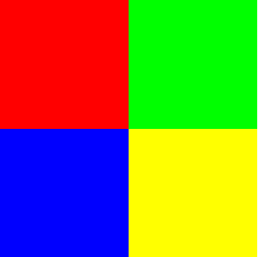
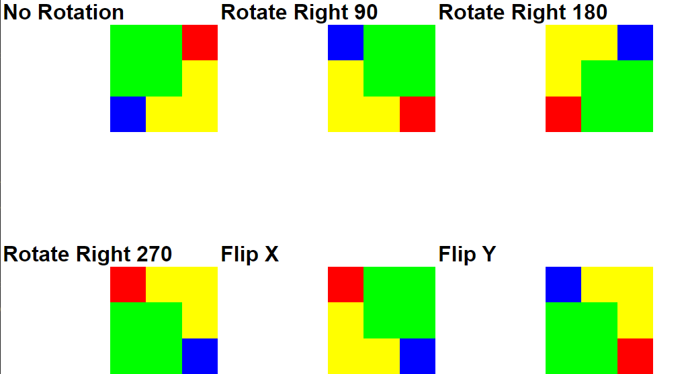
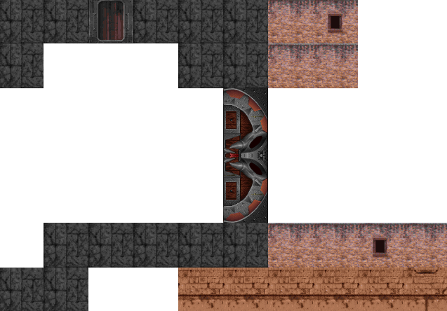
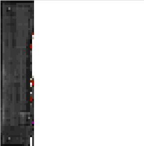
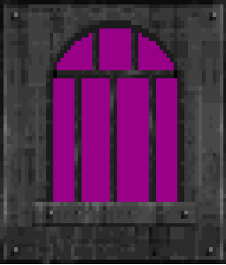
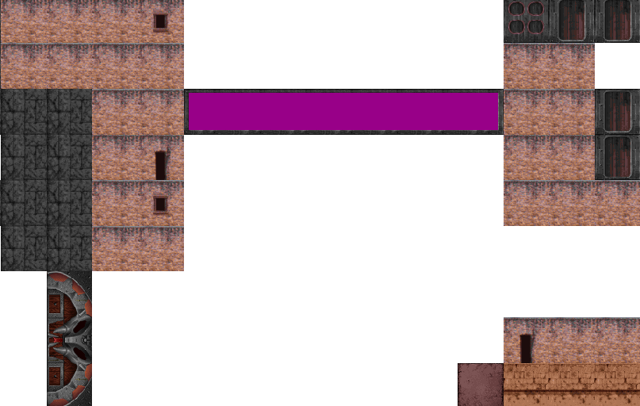
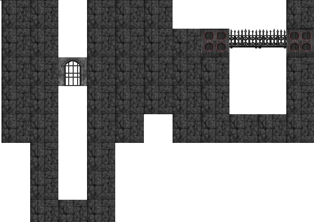

Walls 5 - Oriented Walls
======================

## UI improvements

Getting back into it, the easiest thing I could find to work on were some UI improvements to make the process a little better.  I fixed up the left panel so that it properly deals with overflow and scrollbars are in the right position.  This was actually tricker than I though as there were many levels where I had to declare `overflow: hidden` in order to put the scrollbars on the right element.  I also removed the awkward top bar to free up more space for the map.  The refactoring of scrollbars makes it so that the map has better scroll behavior.  To add panning and zooming I added the `wc-pan-box` element.  You can find more about how it works here: https://dev.to/ndesmic/how-to-make-a-pan-and-zoom-control-with-web-components-4ji6

This allows us to more easily pan and zoom the map for a better experience.

## Tile Map with transforms

Before that we need to make some more enhancements.  Firstly, I'm renaming `TedMap` to `TileMap` as this more agnostically describes what it is, it's a map of tiles, which themselves are bitmaps indexing into a pallet.  But in order to properly show the doors we need to have the ability to rotate the tiles so that they display in the correct orientation.  We do this by adding a new property `setTransforms` that let's us pass in a 2d array of transforms.  For simplicity we only need to consider 4 rotations so we'll just assign those to be values 0-3, however we can also add in mirroring in X and Y so we'll add 2 more (even though I don't think we'll actually use them, this component is now generic so we might as well).

0) No rotations
1) 90 degrees to the left
2) 180 degrees to the left
3) 270 degrees to the left
4) Mirror X
5) Mirror Y

If we follow the draw calls back through the worker, updating the references as we go we'll eventually reach our `renderTiledMap` from `image-utils.js`.  Here we can make some updates, the main draw loop now looks like this:

```js
for (let col = 0; col < width; col++) {
	for (let row = 0; row < height; row++) {
		const tile = tiles[map[row][col]];
		if (tile) {
			if (transforms && transforms[row][col] != undefined){
				context.save();
				context.translate(col * tileSize, row * tileSize);
				switch (transforms[row][col]){
					case 0: {
						context.drawImage(tile, col * tileSize, row * tileSize);
						break;
					}
					case 1: {
						context.translate(halfTile, halfTile);
						context.rotate(Math.PI * 0.5);
						context.translate(-halfTile, -halfTile);
						break;
					}
					case 2: {
						context.translate(halfTile, halfTile);
						context.rotate(Math.PI);
						context.translate(-halfTile, -halfTile);
						break;
					}
					case 3: {
						context.translate(halfTile, halfTile);
						context.rotate(Math.PI * 1.5);
						context.translate(-halfTile, -halfTile);
						break;
					}
					case 4: {
						context.translate(tileSize, 0);
						context.scale(-1, 1);
						break;
					}
					case 5: {
						context.translate(0, tileSize);
						context.scale(1, -1);
						break;
					}
				}
				context.drawImage(tile, 0, 0);
				context.restore();
			} else {
				context.drawImage(tile, col * tileSize, row * tileSize);
			}
		}
	}
}
```
If there are transforms then we see which one and apply it.  Transforms on canvases require transforming the whole canvas.  But we don't want those transform to persist between draws so we use `save()` and `restore()` which act as a stack of transforms we can push and pop.  So we save the old, normal state, apply the transform, draw and then restore back to the normal state again.  Rotations have 3 translates.  The first places the current tile at the origin, we could use the dx,dy offset parameters of `drawImage` but this actually simplifies better.  The second places the tile's center at the origin (since that's what we rotate around), once we've spun the tile around we translate it back to where it was but now rotated.  Scales are similar.  We translate so the current tile is at the origin, but we actually need to shift it one more tile length than that because the flipping will cause the tile to be drawn the opposite direction.

But first we want to test this out in isolation.  One of the benefits is that we'll actually make the component more robust.  To do this I'm making a small little documentation page that shows it off.  The first thing we see is that there's a hardcoded `tileSize` of 64.  Instead we can make that a property with a and pass it through to the worker.  We also see that it only does rendering once, we actually need to to render after every property change otherwise update that come after it's attached to the DOM will never show up.  Another issue is that the path to the worker is now incorrect (and we won't get an error for it!) because it was relative to the `asset-reader.html` page and that's how workers are set unfortunately.  Finally we can also convert the setter methods into actual setters for private properties, a pattern which I use extensively with modern vanilla web-components.  We can update the `attributeChangedCallback` to parse data coming in from attributes:

```js
attributeChangedCallback(name, oldValue, newValue) {
	this[name] = JSON.parse(newValue);
}
```

Note that for other property types this might stop working but it minimally handles arrays and numbers. This means that we don't even need javascript for the test cases.  I'm also going to add a gaurd `this.#rendered` which starts false and will be set to true on initial `this.render()`.  The reason is to prevent the map rendering from triggering on attribute changes since the initial ones can happen before `connectedCallback` triggers.  Another bug I ran into was that when I renamed functions in the worker I accidentally used the same name, which triggered a parse error.  No browser actually tells you this happened, it'll just immediately kill the worker leaving you scratching your head and wondering if the browser itself doesn't work.  I also gave it my standard `wc-` prefix because it's not properly generic.  Finally we can see the fruits of this labor:

```html
<wc-tile-map 
	map="[
  		[0, 1],
  		[2, 3]
	]"
	tiles="[
		[
			[0, 0, 0],
			[0, 0, 0],
			[0, 0, 0]
		],
		[
			[1, 1, 1],
			[1, 1, 1],
			[1, 1, 1]
		],
		[
			[2, 2, 2],
			[2, 2, 2],
			[2, 2, 2]
		],
		[
			[3, 3, 3],
			[3, 3, 3],
			[3, 3, 3]
		]
	]"
	pallet="[
		[255, 0, 0],
		[0, 255, 0],
		[0, 0, 255],
		[255, 255, 0],
		[255, 0, 255],
		[0, 255, 255]
	]"
	tile-size="3"
></wc-tile-map>
```



Now let's try to do some transforms



We can see that it works and that each of the 6 transforms makes a distinct image (eg rotating 180 is not the same as flipping y).

So why did we do all that?

This now gives us a robust component that we can use to draw the tile map and also rotate arbitrary tiles.  This means we can fix the orientation of the door tiles to be correct.

## Oriented Doors

We can port over the code that deals with door orientation from line `1213` if `RT_DOOR.C`:

```js
function isVerticalOriented(map, row, col){
	const up = isDoor(map, row - 1, col)
				? 2
				: isWall(map, row - 1, col)
					? 1
					: 0;
	
	const down = isDoor(map, row + 1, col)
				? 2
				: isWall(map, row + 1, col)
					? 1
					: 0;

	const left = isDoor(map, row, col - 1)
				? 2
				: isWall(map, row, col - 1)
					? 1
					: 0;
					
	const right = isDoor(map, row, col + 1)
				? 2
				: isWall(map, row, col + 1)
					? 1
					: 0;

	if(up === 1 && down === 1) return true;
	if(left === 1 && right === 1) return false;
	if(up > 0 && down > 0) return true;
	if(left > 0 && right > 0) return false;
	if(up > 0) return true;
	if(down > 0) return true;
	if(left > 0) return false;
	if(right > 0) return false;
	return false; //should never happen
}

function isDoor(map, row, col){
	const value = map[0][row][col];
	if(value >= 33 && value <= 35) return true;
	if(value >= 90 && value <= 104) return true;
	if(value >= 154 && value <= 156) return true;
	if((value & 0x8000) && (value & 0x4000) === 1) return true; 
	return false;
}

function isWall(map, row, col){
	const value = map[0][row][col];
	if(value >= 1 && value <= 89) return true;
	if(value >= 106 && value <= 107) return true;
	if(value >= 224 && value <= 233) return true;
	if(value >= 242 && value <= 244) return true;
	return false;
}
```
These are some utility function is figure out if a tile is a door or a wall.  If the door is bordered on its sides `isVerticalOriented` will tell us which way it faces.  If it's vertical we just rotate it 90 degrees:

```js
transformMap[row][col] = isVerticalOriented(map, row, col) ? 1 : 0;
```
For non-oriented walls the transform is `0`.  I've then modified the `loadMap` function to export both the tile map and the map of transforms which can be directly connected to the properties of `wc-tile-map`.  Doing so gives us oriented doors:



## Back to Masked Walls

Masked Wall values exist in plane 0 between values 158 - 179.  In order to draw them we'll need to generate the corresponding tiles.  We somewhat awkwardly did this for doors in `rott-asset.js` by creating door images and adding them to the indexed texture list.  I still can't think of a better place to deal with this so we'll add masked walls there too.

Using the table given in the previous chapter, we can start to add the walls.  However, there seems to be a problem.  Let's try to preview `MASKED2` (modified to absorb out-of-bounds errors):



We get part of what appears to be a panel, but it falls out of sync around column 16.  We can be sure this is probably a transpatch because the initial part is reasonable but it would appear we're missing something when we get to a true transparent part.  After some investigation it seems like the value 254 is something special to the transpatch. But why do we need this when we have the post format which handles holes?  That's the whole purpose of the transpatch, the "transparent" pixels are actually areas that are translucent, with the amount being based on the transparency level for the transpatch (so only one value is allowed).  When we see the value `254` that entire run of pixels is a translucent strip.

Here's the code I came up with:

```js
export function loadTransparentSprite(asset) {
	const dataView = asset instanceof DataView ? asset : new DataView(asset);

	const origSize = dataView.getUint16(0, true);
	const width = dataView.getUint16(2, true);
	const height = dataView.getUint16(4, true);
	const left = dataView.getUint16(6, true);
	const top = dataView.getUint16(8, true);
	const transparency = dataView.getUint16(10, true)
	const columnOffsets = new Array(width);

	for (let col = 0; col < width; col++) {
		columnOffsets[col] = dataView.getUint16(12 + (col * 2), true);
	}
	let index = 12 + (width * 2);

	const bitmap = allocBlockArray(width, height);

	try {
		for (let col = 0; col < width; col++) {
			while (true) {
				let rowStart = dataView.getUint8(index);
				index += 1;
				if (rowStart === 255) break;

				const pixelCount = dataView.getUint8(index);
				index += 1;

				//draw post spans
				let palletIndex;
				for (let row = rowStart; row < rowStart + pixelCount; row++) {
					palletIndex = dataView.getUint8(index);

					if(palletIndex != 254){
						index += 1;
						bitmap[row][col] = palletIndex;
					} else {
						bitmap[row][col] = 255; //255 I think is unused
					}

					
				}
				if(palletIndex === 254){
					index += 1;
				}
			}
		}	
	} catch(ex){
		console.log(ex);
	}

	return bitmap;
}
```
And here's the result of `MASKED2`:



I colored the translucent pixels using index `255` which is the transparent color (physically purple).  Realistically, we need to layer things to actually see what it's supposed to look like, but I think it's black with an alpha of 21/255.  This is actually going to make drawing interesting since we don't support layered drawing in the tile map.  I suppose if we need to extend it we could make an extension pallet that maps to indices > 256 or something, not sure yet.

## Drawing masked s on the map

The first thing we need to do is gather all of our masked entry data.  This is actually more complicated than it seems because these assets are split-up over several sections.  Namely between `MASKSTRT` and `MASKSTOP`, `HMSKSTRT` and `HMSKSTOP`, as well as `EXITSTRT` and `EXITSTOP`.  We can combine all of these into one giant list.  *An important thing to note about how this list is built: Himask entries will be first because those are accessed by index rather than name*.  To extract these entries the code looks almost the same as `extractWalls` and `extractStaticDoorEntries`, so I'm going to make a helper to iterate over all entries in a section:

```js
//wad-utils.js
export function forEachLumpInSection(wad, section, callback) {
	let isSection = false;
	for (let i = 0; i < wad.entries.length; i++) {
		const entry = wad.entries[i];

		if (new RegExp(`${section}STA?RT`).test(entry.name)) isSection = true;
		else if (entry.name === `${section}STOP` || entry.size === 0) {
			if(isSection) break;
			continue;
		}
		else if (isSection) callback(entry);
	}
}

```
The actually a new check here to see if the section is size 0, which normally indicates a new section marker.  `HMSKSTRT` has no corresponding `HMSKSTOP` and this means another inconsistency we need to deal with.  Since the section below it is `GUNSTART` with size `0`, we can use this instead. Another problem is that `extractStaticDoorEntries` could not be converted to use this function because it does index skipping but it simplifies the rest:

```js
//rott-asset.js
export function extractMaskedWallEntries(wad){
	const maskedWalls = [];
	forEachLumpInSection(wad, "MASK", entry => {
		const maskedWall = new DataView(wad.arrayBuffer, entry.offset, entry.size);
		maskedWalls.push([trimString(entry.name), loadTransparentSprite(maskedWall)]);
	});
	return maskedWalls;
}

export function extractHimaskEntries(wad){
	const hiMaskedWalls = [];
	forEachLumpInSection(wad, "HMSK", entry => {
		const hiMaskedWall = new DataView(wad.arrayBuffer, entry.offset, entry.size);
		hiMaskedWalls.push([trimString(entry.name), loadUnknowSprite(hiMaskedWall)]);
	});
	return hiMaskedWalls;
}

export function extractExitEntries(wad) {
	const exits = [];
	forEachLumpInSection(wad, "EXIT", entry => {
		const exit = new DataView(wad.arrayBuffer, entry.offset, entry.size);
		exits.push([trimString(entry.name), loadUnknowSprite(exit)]);
	});
	return exits;
}
```
I refactored the logic to try multiple image time and put it into `rott-asset.js` as `loadUnknownSprite`.  Of course if we can we'd like to use the right one for performance but as it turns out when looking at EXITs they might be walls, they might not, and for HIMASKs they might be transparent or not so we need to be flexible.

```js
//asset-reader.js
const maskedWalls = extractMaskedWallEntries(wad);
const hiMaskedWalls = extractHimaskEntries(wad);
const exits = extractExitEntries(wad);

const maskedIndexMap = Object.fromEntries([...hiMaskedWalls, ...maskedWalls, ...exits].map(([key, value], index) => [key, index]));
```
Now we need to modify the `loadMap` function to accept this new list and figure out how to map the tiles to these textures.

```js
export function loadMap(map, wallTextureCount = 105, doorTextureMap, maskedTextureMap) {
	const height = map[0].length;
	const width = map[0][0].length;
	const tileMap = allocBlockArray(height, width);
	const transformMap = allocBlockArray(height, width);

	for (let row = 0; row < height; row++) {
		for (let col = 0; col < width; col++) {
			const value = map[0][row][col];

			//ref: RT_DOOR.C ln: 1171
			//map walls and doors
			if (value >= 1 && value <= 32) {
				tileMap[row][col] = value - 1;
				transformMap[row][col] = 0;
			} else if (value >= 33 && value <= 35) { //Snake door
				tileMap[row][col] = doorTextureMap ? wallTextureCount + doorTextureMap[doorIndexToName((value - 33) + 15)] : value;
				transformMap[row][col] = isVerticalOriented(map, row, col) ? 1 : 0;
			} else if (value >= 36 && value <= 45) {
				tileMap[row][col] = value - 4;
				transformMap[row][col] = 0;
			} else if (value === 46) {
				tileMap[row][col] = 73;
				transformMap[row][col] = 0;
			} else if (value >= 49 && value <= 71) {
				tileMap[row][col] = value - 9;
				transformMap[row][col] = 0;
			} else if (value >= 80 && value <= 89) {
				tileMap[row][col] = value - 16;
				transformMap[row][col] = 0;
			} else if (value >= 90 && value <= 104) { //Doors
				tileMap[row][col] = doorTextureMap ? wallTextureCount + doorTextureMap[doorIndexToName((value - 90))] : value;
				transformMap[row][col] = isVerticalOriented(map, row, col) ? 1 : 0;
			} else if (value >= 154 && value <= 156) { //Doors
				tileMap[row][col] = doorTextureMap ? wallTextureCount + doorTextureMap[doorIndexToName((value - 154) + 18)] : value;
				transformMap[row][col] = isVerticalOriented(map, row, col) ? 1 : 0;
			}

			//map masked walls
			if (maskedTextureMap) {
				const doorTextureCount = Object.keys(doorTextureMap).length;
				//Masked Walls Go Here (ref: RT_TED.C, ln: 2637)
				const type = tileToMakedType(value);
				if (type) {
					const texture = maskedTypeToTexture(type).bottom;
					if (typeof (texture) === "number") {
						tileMap[row][col] = wallTextureCount + doorTextureCount + texture;
					} else {
						tileMap[row][col] = wallTextureCount + doorTextureCount + maskedTextureMap[texture];
					}
				}
			} else {
				tileMap[row][col] = value;
			}
		}
	}

	return [tileMap, transformMap];
}
```
This gets a tad complicated.  After we do the mapping for walls and doors we then check to see if it's a masked wall.  The first thing we do is convert the tile value to a masked wall type:

```js
function tileToMakedType(value) {
	switch (value) {
		case 157: return "mw_highswitchoff";
		case 158: return "mw_multi1";
		case 159: return "mw_multi2";
		case 160: return "mw_multi3";
		case 162: return "mw_normal1";
		case 163: return "mw_normal1";
		case 164: return "mw_normal2";
		case 165: return "mw_normal2";
		case 166: return "mw_normal3";
		case 167: return "mw_normal3";
		case 168: return "mw_singlepane";
		case 169: return "mw_singlepane";
		case 170: return "mw_dogwall";
		case 171: return "mw_peephole";
		case 172: return "mw_exitarch";
		case 173: return "mw_secretexitarch";
		case 174: return "mw_entrygate";
		case 175: return "mw_highswitchon";
		case 176: return "mw_multi1";
		case 177: return "mw_multi2";
		case 178: return "mw_multi3";
		case 179: return "mw_railing";
		default: return null;
	}
}
```
This step might not be completely necessary since it's an internal mapping but I've preserved it non-the-less especially as it might be used elsewhere.  Could be a map as well but whatever.  If we get a non-null value we know we have masked wall.  So then we convert the masked wall type to the set of textures to display:

```js
function maskedTypeToTexture(value, isMetal) {
	switch (value) {
		case "mw_peephole": return { side: "SIDE21", mid: "ABOVEM4A", top: "ABOVEM4", bottom: "PEEPMASK" };
		case "mw_dogwall": return { side: "SIDE21", mid: "ABOVEM9", top: "ABOVEM4", bottom: "DOGMASK" };
		case "mw_multi1": return { side: "SIDE21", mid: "ABOVEM5A", top: "ABOVEM5", bottom: "MULTI1" };
		case "mw_multi2": return { side: "SIDE21", mid: "ABOVEM5B", top: "ABOVEM5", bottom: "MULTI2" };
		case "mw_multi3": return { side: "SIDE21", mid: "ABOVEM5C", top: "ABOVEM5", bottom: "MULTI3" };
		case "mw_singlepane": return { side: "SIDE21", mid: "ABOVEM4A", top: "ABOVEM4", bottom: "MASKED4" };
		case "mw_normal1": return { side: "SIDE21", mid: "ABOVEM4A", top: "ABOVEM4", bottom: "MASKED1" };
		case "mw_normal2": return { side: "SIDE21", mid: "ABOVEM4A", top: "ABOVEM4", bottom: "MASKED2" };
		case "mw_normal3": return { side: "SIDE21", mid: "ABOVEM4A", top: "ABOVEM4", bottom: "MASKED3" };
		case "mw_exitarch": return { side: "SIDE21", mid: "ABOVEM4A", top: "ABOVEM4", bottom: "EXITARCH" };
		case "mw_secretexitarch": return { side: "SIDE21", mid: "ABOVEM4A", top: "ABOVEM4", bottom: "EXITARCA" };
		case "mw_railing": return { side: null, mid: null, top: null, bottom: "RAILING" };
		case "mw_hiswitchon": return { side: null, mid: 1, top: 3, bottom: 0 };
		case "mw_hiswitchoff:": return { side: null, mid: 1, top: 2, bottom: 0 };
		case "mw_platform1": return { side: null, mid: null, top: isMetal ? 15 : 10, bottom: null };
		case "mw_platform2": return { side: null, mid: null, top: null, bottom: isMetal ? 14 : 8 };
		case "mw_platform3": return { side: null, mid: null, top: isMetal ? 15 : 10, bottom: isMetal ? 14 : 8 };
		case "mw_platform4": return { side: null, mid: isMetal ? 15 : 7, top: isMetal ? 15 : 7, bottom: isMetal ? null : 12 };
		case "mw_platform5": return { side: null, mid: isMetal ? 15 : 7, top: isMetal ? null : 5, bottom: isMetal ? null : 12 };
		case "mw_platform6": return { side: null, mid: isMetal ? 15 : 7, top: isMetal ? null : 5, bottom: isMetal ? 14 : 4 };
		case "mw_platform7": return { side: null, mid: isMetal ? 15 : 7, top: isMetal ? null : 5, bottom: isMetal ? 14 : 4 }; //the same as mw_platform6?
		case "mw_entrygate": return { side: "SIDE21", mid: "ABOVEM4A", top: "ABOVEM4", bottom: "ENTRARCH" };
		default: throw new Error(`Masked index ${value} does not coorispond to a ROTT masked wall asset.`)
	}
}
```
This is the table we figured out last time.  This returns all the different textures but it can also do so in two ways.  It'll either give the lump name or it will give a number which represents an offset from `HMSKSTRT`.  This is where that choice to make himask entries first in the list comes into play.  Anyway, we take the bottom texture because that's the one the character sees.  If it's a number then we simply take the offset from the start of the masked walls, if it's a name then we look it up.

Put it alltogether and we get masked walls:



This is the dragon wall in level 1 of The HUNT Begins.  The purple is because it's translucent.



And here's the starting area where we can see the exit arch.

I think this is good for now.  There's still a few random issues like masked object orientation but we can clean that up later (it's probably the same as door orientation).