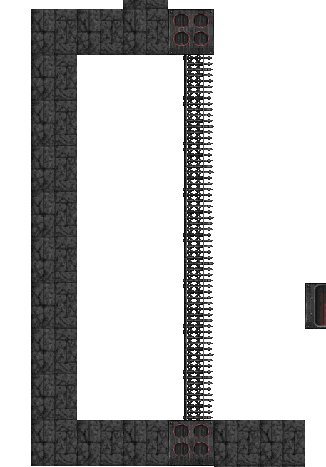

# Duke Assets

## Changes since last time

I completely revamped the repo to not be a list of folders as it was becoming unmaintainable.  Now each part is tagged with its chapter number.  This also makes it easier to see changes between chapters if you look at a diff.  There might be broken links though, I've tried my best but if you see any please file an issue!

Also lets fix the orientation on masked walls.  The routine is near identical for doors:

```js
function isMaskedWall(map, row, col){
	const value = map[0][row][col];
	if(value >= 157 && value <= 160) return true;
	if(value >= 162 && value <= 179) return true;
	if (((value & 0x8000) && (value & 0x4000)) === 1) return true;
	return false;
}

function isMaskedWallVerticalOriented(map, row, col) {
	const up = isMaskedWall(map, row - 1, col)
		? 2
		: isWall(map, row - 1, col)
			? 1
			: 0;

	const down = isMaskedWall(map, row + 1, col)
		? 2
		: isWall(map, row + 1, col)
			? 1
			: 0;

	const left = isMaskedWall(map, row, col - 1)
		? 2
		: isWall(map, row, col - 1)
			? 1
			: 0;

	const right = isMaskedWall(map, row, col + 1)
		? 2
		: isWall(map, row, col + 1)
			? 1
			: 0;

	if (up === 1 && down === 1) return true;
	if (left === 1 && right === 1) return false;
	if (up > 0 && down > 0) return true;
	if (left > 0 && right > 0) return false;
	if (up > 0) return true;
	if (down > 0) return true;
	if (left > 0) return false;
	if (right > 0) return false;
	return false; //should never happen
}
```
We also should renamed `isWallVerticalOriented` to `isDoorVericalOriented`.  Then we can add in the transform map values for the masked walls and get a better result.



## Duke Assets

Since the last bit was such a slog I decided to try something a little more fun.  Lets try to add support for Duke Nukem 3D assets!  Duke Nukem 3D uses the BUILD engine which was built by Ken Silverman.  It was a very similar engine to DOOM although it doesn't really share much lineage.  BUILD supported a ton of features DOOM did not like moving sectors, faux room-over-room, mirrors, destructable environments etc.  This is interesting for us because lots of pieces are similar so our asset reader doesn't need to change much.  First, we need to get ahold of the shareware version which was actually harder than I thought.  While 3D realms still maintains a legacy site https://legacy.3drealms.com/downloads.html, modern browsers don't support ftp so I needed to use IE11 to do it (lol).  When we unzip it we see that we get an installer, so let's install it with DOSBox.


Once done we can look into the resulting game folder:


Using our prior knowledge we can determine a few things.  `.GRP` is probably where the assets are as it's the largest file.  If I were to guess `.RTS` is the levels though I can't prove it.  `.DMO` is probably playthrough demos and the rest don't look readily important.  Anyway let's look at the `.GRP` file.  Doing some Google searches brings up Ken Silverman's (the creator of the BUILD engine's homepage) and there's a small blurb about it.

```
What's the .GRP file format?

The ".grp" file format is just a collection of a lot of files stored into 1 big one. I tried to make the format as simple as possible: The first 12 bytes contains my name, "KenSilverman". The next 4 bytes is the number of files that were compacted into the group file. Then for each file, there is a 16 byte structure, where the first 12 bytes are the filename, and the last 4 bytes are the file's size. The rest of the group file is just the raw data packed one after the other in the same order as the list of files.
```
That seems pretty simple, let's try it.

We make a `grp-file.js` to house the raw format class:

```js
//grp-file.js
import { getString } from "./file-utils.js";

export class GrpFile {
	constructor(arrayBuffer) {
		this.arrayBuffer = arrayBuffer;
		this.dataView = new DataView(arrayBuffer);
		this.signature = getString(this.dataView, 0, 12);
		this.length = this.dataView.getUint32(12, true);

		this.entries = new Array(length);
		let index = 16;
		let runningSize = 0;
		let fileStartIndex = 16 + this.length * 16; //where the file data starts
		for (let i = 0; i < this.length; i++) {
			const size = this.dataView.getInt32(index + 12, true);
			this.entries.push({
				name: getString(this.dataView, index, 12),
				size,
				offset: fileStartIndex + runningSize
			});
			
			runningSize += size;
			index += 16;
		}
	}
}
```
It basically outputs the same entry format as WAD and VSWAP files though we need to calculate the offsets manually as they are sequential in order.  I won't go through the process of wiring it up since it's 90% copy-paste from the WAD file  This produces a useful list:


Now we just need to see what these files are.

### Art Files

Looking through some of the documentation we can see that `.ART` files are where the graphical bits are stored.  They can be named with the suffix `XXX.art` where "X" is a number.  The instructions are to read the files sequentially.  Each one actually contains many assets though, I'm not sure why it's grouped like this.  In `duke3d.grp` the files all have the prefix "TILE", so "TILE000.ART" is the name of the first set of image assets.

We create a file `build-asset.js` which will handle BUILD engine assets (this might be confusing for some but it's consistent with our conventions).  The way the art file works is that we first get a `version` and `numTiles` which are 4 byte integers.  Neither of these are actually useful however.  Next is the `localTileStart` and `localTileEnd` which mark the tile indices of the first and last tile in the file.  By this I mean which asset number.  This is because the resources can be spread over multiple art files.  As the text docs with the code illustrate:

```
sample:  If you chose 256 tiles per art file:
      TILES000.ART -> localtilestart = 0,   localtileend = 255
      TILES001.ART -> localtilestart = 256, localtileend = 511
      TILES002.ART -> localtilestart = 512, localtileend = 767
      TILES003.ART -> localtilestart = 768, localtileend = 1023
```
256 seems to be the most common number.  Here's what I came up with:

```js
//Assets for the BUILD engine, in case it's not clear :)
import { allocBlockArray } from "./array-utils.js";

export function loadArtFile(asset){
	const dataView = asset instanceof DataView ? asset : new DataView(asset);

	const artVersion = dataView.getUint32(0, true); //should be 1
	const numTiles = dataView.getUint32(4, true); //not to be trusted apparently
	const localTileStart = dataView.getUint32(8, true);
	const localTileEnd = dataView.getUint32(12, true);

	const tileSizeX = new Array(localTileEnd - localTileStart + 1);
	const tileSizeY = new Array(localTileEnd - localTileStart + 1);

	let index = 16;

	for(let i = 0; i < tileSizeX.length; i++){
		tileSizeX[i] = dataView.getUint16(index, true);
		index += 2;
	}

	for (let i = 0; i < tileSizeY.length; i++) {
		tileSizeY[i] = dataView.getUint16(index, true);
		index += 2;
	}

	const picAnm = new Array(localTileEnd - localTileStart + 1);

	for (let i = 0; i < picAnm.length; i++) {
		picAnm[i] = dataView.getUint32(index, true);
		index += 4;
	}

	const assets = new Array(localTileEnd - localTileStart + 1);

	for(let i = 0; i < assets.length; i++){
		assets[i] = allocBlockArray(tileSizeX[i], tileSizeY[i]);
		for(let col = 0; col < tileSizeX[i]; col++){
			for(let row = 0; row < tileSizeY[i]; row++){
				assets[i][row][col] = dataView.getUint8(index++);
			}
		}
	}

	return assets;
}
```
This will load the entire art file as an array of indexed bitmaps.  Of course to use these we need to use a palette which is located in `PALETTE.DAT` file in the group.  It was at this point where I realized I had been misspelling "palette" my whole life.  Whoops. find -> replace all.  We've done this palette stuff for several different games now, so I think it's time to make this a first class component to display them.  I call it `palette-view.js`:

```js
export class PaletteView extends HTMLElement {
	#palettes;

	static get observedAttributes() {
		return ["palettes"];
	}
	constructor() {
		super();
		this.bind(this);
	}
	bind(element) {
		element.cacheDom = element.cacheDom.bind(element);
		element.render = element.render.bind(element);
		element.renderPalettes = element.renderPalettes.bind(element);
	}
	connectedCallback() {
		this.render();
		this.cacheDom();
		this.renderPalettes();
	}
	render() {
		this.attachShadow({ mode: "open" });
		this.shadowRoot.innerHTML = `
				<style>
					#palettes { list-style: none; }
					#palettes td { inline-size: 32px; block-size: 32px; }
				</style>
				<ul id="palettes"></ul>
			`;
	}
	cacheDom() {
		this.dom = {
			palettes: this.shadowRoot.querySelector("#palettes"),
		};
	}
	attributeChangedCallback(name, oldValue, newValue) {
		this[name] = newValue;
	}
	set palettes(value){
		if(typeof(value) === "string"){
			value = JSON.parse(value);
		}
		this.#palettes = value;
		this.renderPalettes();
	}
	renderPalettes() {
		if(!this.dom?.palettes) return;
		this.dom.palettes.innerHTML = "";
		for (let map = 0; map < this.#palettes.length; map++) {
			const table = document.createElement("table");
			table.classList.add("palette");
			const li = document.createElement("li");
			const h2 = document.createElement("h2");
			h2.textContent = `palette ${map}`;

			for (let row = 0; row < 16; row++) {
				const tableRow = document.createElement("tr");

				for (let col = 0; col < 16; col++) {
					const tableCell = document.createElement("td");

					const red = this.#palettes[map][row * 16 + col][0];
					const green = this.#palettes[map][row * 16 + col][1];
					const blue = this.#palettes[map][row * 16 + col][2];

					tableCell.style.backgroundColor = `rgb(${red},${green},${blue})`;
					tableCell.style.width = `16px`;
					tableCell.style.height = `16px`;
					tableRow.appendChild(tableCell);
				}
				table.appendChild(tableRow);
			}
			li.appendChild(h2)
			li.appendChild(table);
			this.dom.palettes.append(li);
		}
	}
	attributeChangedCallback(name, oldValue, newValue) {
		this[name] = newValue;
	}
}

customElements.define("palette-view", PaletteView);
```
Nothing fancy.  It takes a list of pallets and displays them in our 16-width grid pattern.

```js
export function getPalette(dataView){
	const paletteView = new PaletteView();
	paletteView.palettes = loadPalettes(dataView);

	return paletteView;
}

export function loadPalettes(dataView){
	const rootPalette = new Array(256);

	for (let i = 0; i < 256; i++) {
		const color = new Array(3);
		color[0] = dataView.getUint8(i * 3) * 4;
		color[1] = dataView.getUint8(i * 3 + 1) * 4;
		color[2] = dataView.getUint8(i * 3 + 2) * 4;
		rootPalette[i] = color;
	}

	return [rootPalette];
}
```
Here is the function that extracts the pallet.  We've seen this before, it's 3-byte values that need to be scaled by 4 to get us RGB value.  If you noticed the `PALETTE.DAT` is actually a lot larger than 768 bytes.  This is because it contains information similar to COLORMAPs which in BUILD parlance are called "Shade Tables".  There's also some other information in there but for this first pass all we need is the base pallet so that's all we return.


There.  We have the Duke Nukem 3d palette. Next we can use the pallet information to color in the bitmap.

```js
export function getArtFile(groupFile, dataView){
	const assets = loadArtFile(dataView);
	const palettes = loadPalettes(groupFile.getByName("PALETTE.DAT"));

	const div = document.createElement("div");
	div.style = "height: 100%; overflow-y: auto";
	for(let i = 0; i < assets.length; i++){
		const header = document.createElement("h2");
		header.textContent = `Asset ${i}`;
		div.append(header);
		if(assets[i].length === 0) {
			div.append(getNullAsset());
		} else {
			const indexBitmap = new IndexBitmap();
			indexBitmap.setBitmap(assets[i]);
			indexBitmap.setPalette(palettes[0]);
			indexBitmap.height = assets[i].length;
			indexBitmap.width = assets[i][0].length;

			div.append(indexBitmap);
		}
	}

	return div;
}

```
Since each file is actually a list of assets we want to be able to display all of them (especially since UI hasn't been built to filter it).  So we iterate through all of them and stick them in a div (it's not pretty but it works).  The div needs overflow otherwise we cannot scroll down through them.  Also many assets have dimensions 0 which means it's empty.  I guess the must have been hard-coded indicies or something.  In that case we append a null asset message.  I also threw in a header so you can reference an asset by it's index.  When it's all said and done we get a scrollable list of image assets:


This is from file `TILES007.ART`.  We can see a nicely rendered pig cop.  Note that the aspect ratio restriction is the same as Doom, ROTT and Wolfenstien, just an artifact of how hardware worked then.

That was pleasantly easier than the others to add support for.  Very interesting to see how different games do it and what sorts of ideas they have.  BUILD assets aren't very compact, but they are pretty straightforward to understand.

Notes:

- `extractPalette` was changed to `loadPalette` to be more consistent.  `load` functions get binary data and convert them to something usable, `get` functions create DOM suitable previews.  I think this might need more separation in the future though as the asset libraries probably shouldn't really deal with DOM.

References:
- http://www.advsys.net/ken/build.htm
- https://moddingwiki.shikadi.net/wiki/ART_Format_(Build)
- https://wiki.eduke32.com/wiki/Palette_data_files