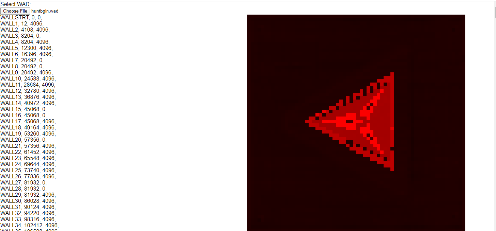

Reading Walls: A First Attempt
==============================

Now that we can read things from the WAD the first thing is to figure out if we can make something of the packed assets.  Probably the easiest place to start will be walls since they seem to have a simple format of 4096 bytes (64x64).  You may also have noticed that the WAD format uses 0 length entries.  These are used to mark sections.  In this case we know all walls are between entries `WALLSTRT` and `WALLSTOP`.

I'm going to modify our `wad-reader` component to show a preview of the wall when we click it.  I find that making these sorts of tools not only helps development down the line but makes it easier to chunk up a problem for testing before loading it up into a complex system.

For this we'll create a `wad-asset.js` file that will give us some sort of visual representation of the asset.  For a wall we need to get the chunk of data describing a wall and turn it into and image.  We do this by creating a canvas, pulling out the pixel image data, and then passing it back to append to the preview window.

Walls in ROTT are 64x64 bitmaps.  What we don't know yet is where the palette comes from.  So for this exercise let's just assign the 256 values to the red color and see what happens.  Also note that everything is defined in columns, not rows as you may expect so you need to flip the coordinates to get it at the right orientation.

```js
function getWall(dataView){
	const canvas = document.createElement("canvas");
	canvas.height = 64;
	canvas.width = 64;
	const context = canvas.getContext("2d");
	const imageData = context.getImageData(0, 0, 64, 64);

	for(let col = 0; col < 64; col++){
		for(let row = 0; row < 64; row++){
			const pixelOffset = (col * 64 * 4) + (row * 4);
			imageData.data[pixelOffset] = dataView.getUint8((row * 64) + col); //red
			imageData.data[pixelOffset + 1] = 0; //green
			imageData.data[pixelOffset + 2] = 0; //blue
			imageData.data[pixelOffset + 3] = 255
		}
	}

	context.putImageData(imageData, 0, 0);

	return canvas;
}
```

This seems to get results that look reasonable.



For the palette, we need to dig around the source code but it should be roughly similar to a Doom palette (https://doomwiki.org/wiki/PLAYPAL).  This is specified in the WAD itself as the `PLAYPAL` lump. Doom also used 34 colormaps defined in the `COLORMAP` lump for lighting effects, but we can see the size of this lump is only 8192 bytes for ROTT.  Divide this by 256 (the size of each color map) and we get an even 32.  So there are 32 color maps.

Sources
-------

- Doom Picture Format: https://doomwiki.org/wiki/Picture_format
- Doom palette: https://doomwiki.org/wiki/PLAYPAL
- Doom Colormap: https://doomwiki.org/wiki/COLORMAP