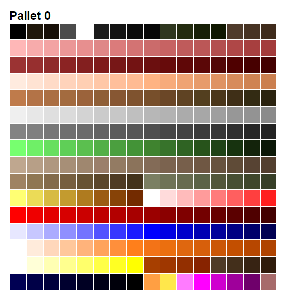
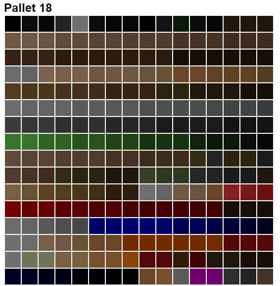

Pallets
=======

While I couldn't figure out the base pallet for ROTT we can still talk about how they work in the WAD-based engine world.  For this, we can implement the Doom pallet system to our wad viewer.  Doom has a lump called `PLAYPAL` which contains 14 pallets of 256 colors each, with each color represented by 3 bytes (red, green, blue).  This represents all the colors in the game.

Pallet 0 is the base pallet for Doom, while the others are used for special screen tinting purposes like the invulnerability (black and white), different levels of damage (red), radiation suit (green), and item pickups (yellow).  We show the maps with the following wad-asset code.

```js
function getPlayPal(dataView){
	const mapCount = dataView.byteLength / 768;
	const ul = document.createElement("ul");

	for(let map = 0; map < mapCount; map++){
		const table = document.createElement("table");
		table.classList.add("pallet");
		const li = document.createElement("li");
		const h2 = document.createElement("h2");
		h2.textContent = `Pallet ${map}`;
		
		for(let row = 0; row < 16; row++){
			const tableRow = document.createElement("tr");

			for(let col = 0; col < 16; col++){
				const tableCell = document.createElement("td");

				const offset = (map * 768) + (row * 16 * 3) + (col * 3);
				const red = dataView.getUint8(offset);
				const green = dataView.getUint8(offset + 1);
				const blue = dataView.getUint8(offset + 2);

				tableCell.style.backgroundColor = `rgb(${red},${green},${blue})`;
				tableRow.appendChild(tableCell);
			}
			table.appendChild(tableRow);
		}
		li.appendChild(h2)
		li.appendChild(table);
		ul.appendChild(li);
	}

	return ul;
}

```

Here we can see the base Doom pallet:



This isn't how things are actually drawn though, before that we run them through the colormap. `COLORMAP` is a lump that defines 34 maps, each map is 256 bytes each representing an index into the current `PLAYPAL` pallet.  Color maps are mostly for lighting in the Doom engine with each map representing a different darkness level.  So as sector brightness changes as well as the distance from the player, the colormap used becomes darker.  To show colormaps we need to know the pallet, so we get the `PLAYPAL` first.  For preview purposes we only need the base pallet so we won't worry about the other 13 for now.

```js
function getColorMap(wad, dataView){
	//get base pallet
	const playPal = wad.get("PLAYPAL")
	const mapCount = dataView.byteLength / 256;
	const ul = document.createElement("ul");

	for(let map = 0; map < mapCount; map++){
		const li = document.createElement("li");
		const table = document.createElement("table");
		table.classList.add("pallet");
		const h2 = document.createElement("h2");
		h2.textContent = `Pallet ${map}`;

		for (let row = 0; row < 16; row++) {
			const tableRow = document.createElement("tr");

			for (let col = 0; col < 16; col++) {
				const tableCell = document.createElement("td");

				const playPalIndex = dataView.getUint8((map * 256) + (row * 16) + col) * 3;
				const red = playPal.getUint8(playPalIndex);
				const green = playPal.getUint8(playPalIndex + 1);
				const blue = playPal.getUint8(playPalIndex + 2);

				tableCell.style.backgroundColor = `rgb(${red},${green},${blue})`;
				tableRow.appendChild(tableCell);
			}
			table.appendChild(tableRow);
		}

		li.appendChild(h2)
		li.appendChild(table);
		ul.appendChild(li);
	}

	return ul;
}
```

One of the darker colormaps:



We sprinkle a few CSS styles to make the table boxes bigger (I chose 32px).  I also like the table format because we could do things like overlay the index in the future.

ROTT also has color maps.  Without the base pallet we're not sure what to do with them yet.  However they also have special named maps like `TANMAP` and `PURPMAP` that seem to be used in special cases (I think the green map is used for gas traps for example).  The idea should be similar to what Doom is doing.  Next time we'll see if we can figure out the ROTT pallet and wire up the new color mapping to the wall asset display.  Perhaps we can try to see if we can load Doom textures (I though this would just work™ but something went wrong).

Notes
-----

- The WAD Reader output is now a table so it's easier to read (and add fields if needed in the future).
- We now add null ("\0") padding to the end of lump names when reading so you don't have to remember to do it yourself.

Sources
-------
- Doom Pallet: https://doomwiki.org/wiki/PLAYPAL
- Doom Colormap: https://doomwiki.org/wiki/COLORMAP