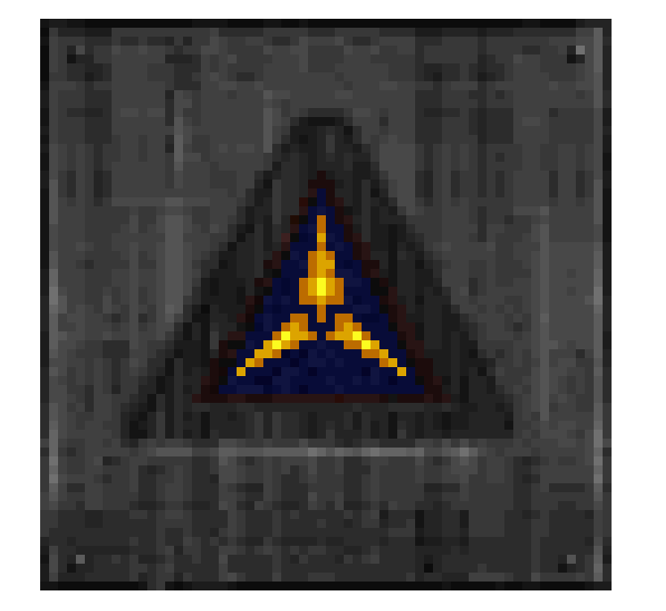
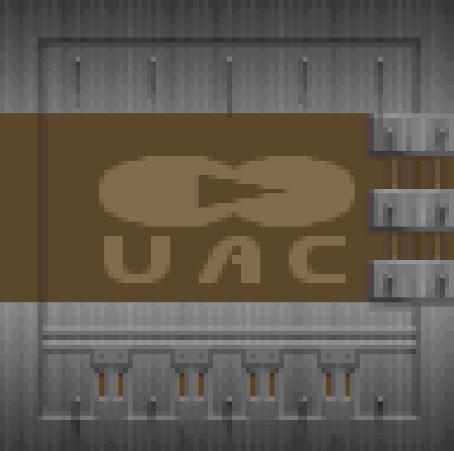

Walls Part 2: We Have Color
===========================

After much digging in the ROTT source code I found by checking references for `colormap` that is is assigned to by an object called `origpal` (which sounds like what we want). That the palette is loaded in `RT_MAIN.C`.

```C
void Init_Tables (void){
	// ...stuff

   origpal=SafeMalloc(768);
   memcpy (origpal, W_CacheLumpName("pal",PU_CACHE), 768);

   //...stuff
```

This means palettes are probably in lump `pal` and it matches the Doom `PLAYPAL` size, 768 bytes.  This now seems obvious in retrospect but when you're digging through 1000 lumps you don't see it.  Anyway, we can wire this up using the same function as `PLAYPAL` and we get a preview.  


Then we can change the wall texture rendering code to index into the palette.

```js
//getWall()
const palette = wad.get("PLAYPAL") ?? wad.get("PAL");

// ...

//main getWall loop
for(let col = 0; col < 64; col++){
	for(let row = 0; row < 64; row++){
		const pixelOffset = (col * 64 * 4) + (row * 4);
		const paletteIndex = dataView.getUint8((row * 64) + col);
		const paletteOffset = paletteIndex * 3;
		imageData.data[pixelOffset] =  palette.getUint8(paletteOffset); //red
		imageData.data[pixelOffset + 1] = palette.getUint8(paletteOffset + 1); //green
		imageData.data[pixelOffset + 2] = palette.getUint8(paletteOffset + 2); //blue
		imageData.data[pixelOffset + 3] = 255 //alpha
	}
}
```



And it works!  Look at those nice textures.  Unfortunately, it's not so simple for Doom textures.  ROTT uses 64 * 64 indexed bitmaps but Doom is more sophisticated as it allows omitting certain data for better compression. https://doomwiki.org/wiki/Picture_format. Note that this format will come into play when we talk about ROTT's sprites.

Basically there's more metadata as Doom defines "posts" or vertical columns of pixels.  These can have offsets and lengths and the empty space is considered transparent.

```js
function getDoomImage(wad, dataView){
	const palette = wad.get("PLAYPAL") ?? wad.get("PAL");
	const width = dataView.getUint16(0, true);
	const height = dataView.getUint16(2, true);
	const left = dataView.getUint16(4, true);
	const top = dataView.getUint16(6, true);
	const canvas = document.createElement("canvas");
	canvas.height = height;
	canvas.width = width;
	const context = canvas.getContext("2d");
	const imageData = context.getImageData(0, 0, width, height);
	const columnOffsets = [];

	for(let col = 0; col < width; col++){
		columnOffsets[col] = dataView.getUint32(8 + (col * 4), true);
	}
	let index = 8 + (width * 4);

	for(let col = 0; col < width; col++){
		const rowStart = dataView.getUint8(index);
		if(rowStart === 255) {
			index++;
			continue;
		}
		const pixelCount = dataView.getUint8(index + 1);
		index += 3; //advance one more byte because of unused padding
		for(let row = rowStart; row < rowStart + pixelCount; row++){
			const pixelOffset = (row * width * 4) + (col * 4);
			const paletteIndex = dataView.getUint8(index);
			const paletteOffset = paletteIndex * 3;

			imageData.data[pixelOffset] = palette.getUint8(paletteOffset); //red
			imageData.data[pixelOffset + 1] = palette.getUint8(paletteOffset + 1); //green
			imageData.data[pixelOffset + 2] = palette.getUint8(paletteOffset + 2); //blue
			imageData.data[pixelOffset + 3] = 255

			index++;
		}
		index += 2; //advance one more byte because of unused padding (and some 255 value that ends the col)
	}

	context.putImageData(imageData, 0, 0);

	return canvas;
}
```



This function is pretty sloppy because I don't understand the data, like what `columnOffset` is and what the top and left are.  I also couldn't quite get columns with multiple spans working but if I did it would work for monster sprites too!  Regardless, it works for most wall textures so I'm happy for now.

Next time I'd like to get Doom sprites working and maybe clean up the interface a bit.  The constant scrolling for the preview is annoying, the table could use headers and it would be nice to have filesystem support so we don't have to load the WAD every time we test.

Notes
-----

- The asset switch is a little more precise with matching (for future updates) but it's not going to be able to work with both Doom and Rott without some updates to "inspect" the WAD to see which one it's for as they are both a little different.
- Added index numbers to the lump display.
- Added a `wad-utils.js` with stuff for dealing with WADs, only one function so far to read strings.

Sources
-------
- https://doomwiki.org/wiki/Picture_format
