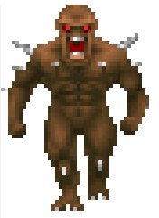
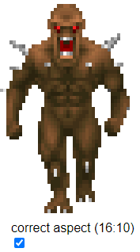
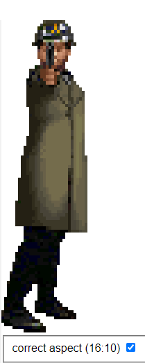

Sprites
=======

Fixing up the code for sprite display wasn't too hard.  Basically each post has multiple spans and when you see a span with offset 255 (the largest height) then you stop and move to the next post.

```js
renderImage(){
	const pallet = this.wad.get("PLAYPAL") ?? this.wad.get("PAL");
	this.width = this.lump.getUint16(0, true);
	this.height = this.lump.getUint16(2, true);
	const left = this.lump.getUint16(4, true);
	const top = this.lump.getUint16(6, true);
	this.dom.canvas = this.dom.canvas;
	this.dom.canvas.height = this.height;
	this.dom.canvas.width = this.width;
	this.dom.canvas.style.height = `${this.height * 4 * 1.16}px`;  //images don't use square pixels sostretch
	this.dom.canvas.style.width = `${this.width * 4}px`;
	const context = this.dom.canvas.getContext("2d");
	const imageData = context.getImageData(0, 0, this.width, this.height);
	const columnOffsets = [];

	for (let col = 0; col < this.width; col++) {
		columnOffsets[col] = this.lump.getUint32(8 + (col * 4), true);
	}
	let index = 8 + (this.width * 4);

	for (let col = 0; col < this.width; col++) {
		while (true) {
			const rowStart = this.lump.getUint8(index);
			index += 1;
			if (rowStart === 255) break;

			const pixelCount = this.lump.getUint8(index);
			index += 1; 
			
			//advance one more byte because of unused padding
			index += 1;

			//draw post spans
			for (let row = rowStart; row < rowStart + pixelCount; row++) {
				const pixelOffset = (row * this.width * 4) + (col * 4);
				const palletIndex = this.lump.getUint8(index);
				index += 1;
				const palletOffset = palletIndex * 3;

				imageData.data[pixelOffset] = pallet.getUint8(palletOffset); //red
				imageData.data[pixelOffset + 1] = pallet.getUint8(palletOffset + 1); //green
				imageData.data[pixelOffset + 2] = pallet.getUint8(palletOffset + 2); //blue
				imageData.data[pixelOffset + 3] = 255;
			}

			index += 1; //advance one more byte because of unused padding
		}
	}

	context.putImageData(imageData, 0, 0);
}
```

Still some stuff that we're not using (probably bounding box stuff) but we can display sprites with "holes."



The imp is a bit short and fat, this is because in Doom pixels aren't squares.  We'll need to stretch them a bit.



The element that paints Doom images was moved into the ominous sounding component `doom-image.js`.  This makes it easier to add new things, in this case an aspect ratio toggle but I'm thinking in the future it might be useful to render the sprite with different colormaps or pallets and we can do some of that there.  It's a tad messy but not too bad.

If you are doing you own implementations and need a guide, I've created one for the [TROOA1 sprite](https://ndesmic.github.io/webrott/visual-aids/trooa1.html).

Rise of the Triad images are very similar (but not quite the same) so we can more or less copy `doom-image.js` and tweak a few things to make `rott-image.js`:

```js
renderImage() {
	const pallet = this.wad.get("PAL");
	this.origSize = this.lump.getUint16(0, true);
	this.width = this.lump.getUint16(2, true);
	this.height = this.lump.getUint16(4, true);
	const left = this.lump.getUint16(6, true);
	const top = this.lump.getUint16(8, true);
	this.dom.canvas = this.dom.canvas;
	this.dom.canvas.height = this.height;
	this.dom.canvas.width = this.width;
	this.dom.canvas.style.height = `${this.height * 4 * 1.16}px`;  //images don't use square pixels so stretch
	this.dom.canvas.style.width = `${this.width * 4}px`;
	const context = this.dom.canvas.getContext("2d");
	const imageData = context.getImageData(0, 0, this.width, this.height);
	const columnOffsets = [];

	for (let col = 0; col < this.width; col++) {
		columnOffsets[col] = this.lump.getUint16(10 + (col * 2), true);
	}
	let index = 10 + (this.width * 2);

	for (let col = 0; col < this.width; col++) {
		while (true) {
			let rowStart = this.lump.getUint8(index);
			if (rowStart === 255) { index++; break; } //consume the byte

			const pixelCount = this.lump.getUint8(index + 1);
			index += 2; //consume rowStart and pixelCount

			//draw post spans
			for (let row = rowStart; row < rowStart + pixelCount; row++) {
				const pixelOffset = (row * this.width * 4) + (col * 4);
				const palletIndex = this.lump.getUint8(index);
				const palletOffset = palletIndex * 3;

				imageData.data[pixelOffset] = pallet.getUint8(palletOffset); //red
				imageData.data[pixelOffset + 1] = pallet.getUint8(palletOffset + 1); //green
				imageData.data[pixelOffset + 2] = pallet.getUint8(palletOffset + 2); //blue
				imageData.data[pixelOffset + 3] = 255;

				index++;
			}
		}
	}

	context.putImageData(imageData, 0, 0);
}
```

Things specifically to notice is that the there is an extra `origsize` in the lump header.  Also the column offsets (those things we haven't been using so far) are 16-bit ints not 32-bit like Doom's so we have to make sure we are incrementing indicies and such the same.  Lastly, it doesn't have the weird padding bytes.  From what I found while researching the padding might be remnant of the NeXT workstations Id famously used to make Doom.  Anyway with a few things tweaked here's our lightning gaurd:



Neat.  Also, unlike Doom, walls and sprites use different image formats.  We still need our code for drawing the walls, we can just abstract that out into another custom element called `rott-wall`.  To be honest, I don't know if these should be stretched or not as the triangles look pretty equilateral in native pixels.

Here's a guide for the [LIGSHOO4 sprite](https://ndesmic.github.io/webrott/visual-aids/ligshoo4.html).

Note on debugging
-----------------
You have to carefully follow along with the algorithm in the debugger.  I used a little code snippet (using Chrome's handy snippet panel in devtools) to help me read the bytes in the lump:

```
window.dvGetNextBytes = function dvGetNextBytes(dataView, count, offset = 0){
    const bytes = [];
    for(let i = 0; i < count; i++){
        bytes.push(dataView.getUint8(offset + i));
    }
    return bytes;
}
```
This lets me print out the data in the `DataView` at a certain index and up to a certain amount (so it's still readable).  Using this I could follow the algorithm by hand and it let me get a better sense of where things should line up and if what I get is reasonable.  In fact, what I found is that `left` and `top` were getting garbage in `rott-image`, I'm still not sure why but once I started ignoring those the rest lined up as expected.  It was also helpful to find some images of sprites because then I could pixel count to make sure the posts were getting the expected values for offset and length.  You only really need to do this for the first few before the algorithm falls into place.

Notes
-----
- Lots of duplicated assets were moved into the `shared` top level project and cleaned up.
- Folder names shortened because it's just annoying typing those into the terminal all the time.
- The project should be run `npm start` from root rather than indiviudal projects now (to account for asset relocation).
- Add a method to check the was for which type it is `rott` or `doom`, it's pretty simplistic, it checks the name of the pallet lump to determine which one.
- Fixed some display annoyances like making the two columns seperately scrollable so it's easy to see assets further down the list.

Sources
-------
- https://doomwiki.org/wiki/Picture_format

