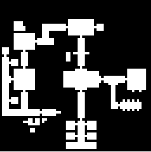
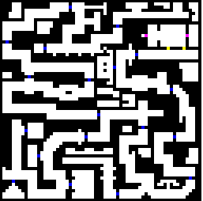
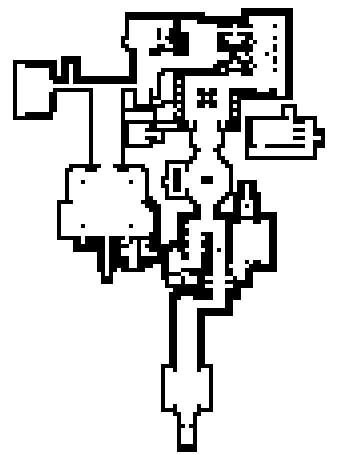

Maps Part 2: Wolfenstien
========================

Out of curiosity I wanted to find out how close the ROTT level format is to Wolfenstien 3D.  So let's look at that.

Wolfenstien 3D
--------------

Wolfenstien map files are made up of a couple game files, `MAPHEAD.{ext}` which contains some offset into the actual map data which is located in `GAMEMAPS.{ext}`.  `ext` here can be a number of different things depending on the version of Wolfenstien 3D you are running.  `WL1` is the shareware version (episode 1), `WL3` is the registered version (episodes 1-3), `WL6` is the full version with all 6 episodes, `SDM` is the demo of Spear of Destiny (levels 1-2), and `SOD` is the full Spear of Destiny (levels 1-21).  Maps have somewhat familiar properties:

```C
typedef struct
{
	unsigned	RLEWtag;
	long		headeroffsets[100];
	byte		tileinfo[];
} mapfiletype;

typedef	struct
{
	long		planestart[3];
	unsigned	planelength[3];
	unsigned	width,height;
	char		name[16];
} maptype;
```
While looking into this I found more interesting tidbits about TeD and this explains some of the weirdness in the structs.  First is the RLEW tag which for all iD games is always `0xabcd` (not so in ROTT!). There is space for 100 levels which is how many TeD seems to allocate, Wolfenstien is hardcoded to use only 60 which is how many appear in the original game with all 6 episodes.  The offsets also indicate unused levels.  An offset of `0` means the level is not used, however sometimes that offset might be `0xffffffff` instead. I found this was true when trying files from version 1.0 of Wolfenstien.  Lastly we have the `tileinfo[]` array.  This is something TeD adds in certain games, in Wolfenstien it is unused, the total `MAPHEAD` files size is 402 bytes, 100 offsets plus the RELW tag.

`GAMEMAPS` has 3 planes as exported from TeD but only 2 are used for Wolfenstien.  The size is always 64x64 and the names for the shareware episode maps will look like `Wolf1 Map1`, `Wolf1 Boss`, `Wolf1 Secret` etc.  Note that version 1 of Wolfenstien calls this file `MAPTEMP.{ext}`.  This is an uncompressed working version of the map file and used by some games edited with TeD.  Taking a look at some of my Apogee games it's a toss-up if it's `GAMEMAPS` or `MAPTEMP`.  I found a shareware version of Wolfenstien that still had the format and thought it would be a good idea to add support for it because it would allow us to read the map data uncompressed to have a test case for the compression.

So what we do is first read in `MAPHEAD`, get the relw tag and grab 100 offsets.  We can filter out the offsets that are `0` or `0xffffffff` and we are left with offsets to actual levels.  Using `GAMEMAPS` we read from the offset of the level and grab all the `maptype` data. 

```js
if(e.target.files.length === 2 && (extension === "wl1" || extension === "wl3" || extension == "wl6" || extension === "sdm" || extension === "sod")){
	const gameMapFile = files.find(f => {
		const fileName = getName(f.name);
		return fileName === "gamemaps" || fileName === "maptemp";
	});
	const camackCompressed = getName(gameMapFile.name) === "gamemaps";
	const headerArrayBuffer = await readFile(files.find(f => getName(f.name) === "maphead"));
	const mapArrayBuffer = await readFile(gameMapFile);
	this.mapFile = new GameMapsFile(mapArrayBuffer, new MapHeadFile(headerArrayBuffer),  camackCompressed);
	this.dom.entries.innerHTML = "";
	let index = 0;
	for(let map of this.mapFile.maps){
		const thisIndex = index;
		const tr = document.createElement("tr");
		tr.addEventListener("click", () => this.loadMap(thisIndex, "wolf"));
		const indexCell = document.createElement("td");
		indexCell.textContent = index + 1;
		const nameCell = document.createElement("td");
		nameCell.textContent = map.name;
		tr.appendChild(indexCell);
		tr.appendChild(nameCell);
		this.dom.entries.appendChild(tr);
		index++;
	}
```

We need to modify the map-reader to accept new file types and take multiple files in the case of Wolfenstien.  Since we'll be able to read TeD map types it should not be hard to add more support for games like Blake Stone (which I might look into).

Layer 1 (Walls)
---------------

We stopped here for ROTT but since we're looking at Wolfenstien at the moment lets try it out.  The uncompressed blocks should yeild 64x64 16-bit values.  Each represents one tile, and they start in the upper left and end in the lower right.  Note that the first 16-bits at the layer offset is the decompressed size, for Wolfenstien this is always `8192` (`64*64*2`), make sure you don't make the mistake I did and read that into the map block or things won't line up.  Otherwise it's nearly identical to how we read the layer in part 6.

Now we can interpret the values.
- 0-64: Walls
- 90-91: Default unlocked door
- 92-93: Gold locked door
- 94-95: Silver locked door
- 100-101: Elevator door
- 106-143: Areas (basically open space but labeled for AI behavior)

The first pass of drawing the map let's just do all the walls as black and everything else white:



That looks like Wolfenstien level 1 to me.  We can also markup the other parts in different colors:



This is the secret level.  The readability sucks but we can see that there are doors, elevator doors and gold locked doors if we squint.  This looks good.

The map render code:

```js
renderMap() {
			const context = this.dom.canvas.getContext("2d");
			this.dom.canvas.width = 64;
			this.dom.canvas.height = 64;
			this.dom.canvas.style.width = `${64 * 4}px`;
			this.dom.canvas.style.height = `${64 * 4}px`;

			context.fillStyle = "#ffffff";
			context.fillRect(0, 0, 64, 64);
			const imageData = context.getImageData(0, 0, 64, 64);

			for(let row = 0; row < 64; row++){
				for(let col = 0; col < 64; col++){
					const value = this.map[0][row][col];
					const pixelOffset = (row * 64 * 4) + (col * 4);

					if(value < 64){ //A wall
						imageData.data[pixelOffset + 0] = 0;
						imageData.data[pixelOffset + 1] = 0;
						imageData.data[pixelOffset + 2] = 0;
						imageData.data[pixelOffset + 3] = 255;
					}
					if (value >= 90 && value < 92) { //A Door
						imageData.data[pixelOffset + 0] = 0;
						imageData.data[pixelOffset + 1] = 0;
						imageData.data[pixelOffset + 2] = 255;
						imageData.data[pixelOffset + 3] = 255;
					}
					if (value >= 92 && value < 94) { //Gold Door
						imageData.data[pixelOffset + 0] = 255;
						imageData.data[pixelOffset + 1] = 255;
						imageData.data[pixelOffset + 2] = 0;
						imageData.data[pixelOffset + 3] = 255;
					}
					if (value >= 94 && value < 96) { //Silver Door
						imageData.data[pixelOffset + 0] = 127;
						imageData.data[pixelOffset + 1] = 127;
						imageData.data[pixelOffset + 2] = 127;
						imageData.data[pixelOffset + 3] = 255;
					}
					if (value >= 100 && value < 102) { //Elevator Door
						imageData.data[pixelOffset + 0] = 255;
						imageData.data[pixelOffset + 1] = 0;
						imageData.data[pixelOffset + 2] = 255;
						imageData.data[pixelOffset + 3] = 255;
					}
				}
			}

			context.putImageData(imageData,0,0);
		}
```

ROTT Layer 1
------------

We're going to do the same things for ROTT.  However, we'll need to skip the first 3 tiles as they just contain metadata.  ROTT has a bunch of special values:

- \>89, 33-35, 44, 45, 0: These are not walls
- <=32: These do something special, not sure what yet
- 76-79: These do something special with elevators (at different orientations), and set data in layer 3.
- 47,48: Not sure what these do but they set some data in layer 3.

The rest are walls of some sort.  We can apply black pixels to all other values and this is what we get:



That looks a lot like the first shareware level to me!

Next time perhaps we'll look more a the maps and see if we can figure out the Carmack compression used in later versions of the Wolfenstien map format.

Notes
-----

- Wolfenstien maps are signed with TeD 5 version 1.0.
- The Wolfenstien source has a variable called `tinf`, this confused me at first but I think it stands for "tileInfo"
- rtl-map was renamed to rott-map
- `wads` was renamed to `game-files` because I put Wolfenstien data there to play with.

Sources
-------

- http://gaarabis.free.fr/_sites/specs/wlspec_index.html (Wolf3d File Specs)
- http://www.shikadi.net/moddingwiki/GameMaps_Format (TeD file info)