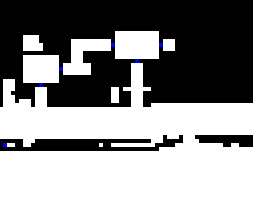
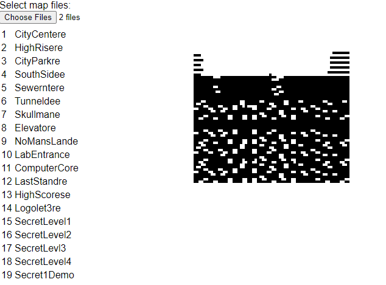
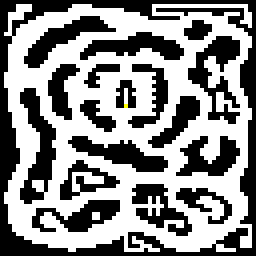

Maps Part 3: Carmack Compression
================================

We left off before looking at Carmack compression. Let's see if we can do that now with `GAMEMAPS.WL1`.

Carmack compression works like this (apparently Carmack stumbled onto LZW without realizing it):

- Read 16-bit values from the input buffer
- If the high byte of the 16-bit value is `0xa7` or `0xa8` we are going to repeat a previous sequence.
- For `0xa7`, the low byte is the length.  We read one more byte to get the offset.  So where the output index/pointer is at right now, count back `offset` *words* and then replay them onto the output buffer for `length`.
- For `0xa8`, the low byte is the length but we read 2 more bytes.  This value is an offset from the start of the output sequence.  So from the beginning of the output add `offset` and then replay the sequence onto the output buffer for `length`.
- If we need a value that natually has high byte `0xa7` or `0xa8` then we do a little trick.  Since repeat `0` has no meaning we can use it.  Take `[0x0,0xa7]` for instance.  When we see this we read one more byte.  This new byte is the *lower* byte of the 16-bit value and `0xa7` is the high byte.

This turned out to be hard.  Not because the algorithm is super hard but because it's easy to mess up and not very easy to tell what happened.  We can't reasonably manually walk through the whole thing because it's thousands of bytes long and as I found graph paper doesn't usually have space for 64 square in either orientation.  So while I could verify the first 100 or so bytes and they were reasonable, I kept getting infinite (or near infinite) loops and out of bounds reads and writes indicating something when very wrong.

I also found out that the v1 game files were not a great resource for debugging.  The level actually changed slightly between versions.  The data is still usable as a guide but sometimes different, meaning more mental overheading in the already complicated debugging process.

Debugging the Compression
-------------------------
In order to debug it, I first modified the code so that when we tried to read off the end it immediately bailed out.  
Then, I had to do the same for the RELW decompression since it will also end up with garbage data.  Once that was done, I could at least get a partial image of the map.



From here we can tell where the anomoly occured and use paint to measure where it happened (col 38, row 27).  From there we can calculate it back, `((26*64)+38) * 2=3404`.  So in our debugger in the RELW compression we set a conditional breakpoint when the output buffer reaches `3404` and inspect what the input index is.  Then set another conditional breakpoint in the Carmack compression when the output index reaches that value and we fall around where the bug happened.  Very painstaking. 

For anyone implementing I encourage you to stick with the original 16-bit word setup rather than bytes.  It's just less things to mess up as many bugs were related to forgetting to update an index properly because some things are multiplied by 2 or offset by 2.  Also, remember that when you are repeating a sequence, so long as you are incrementing the output index, you do not need to add an offset to it as advancing the output index will naturally pull the back pointer forward.

---

Well now we have a map reader capable of reading lots of different TED maps.  I even threw some Bio Menance in there for good measure and while the map render doesn't really show much you can make out some correctness in the sillouette.  Unfortunately the Camackized versions don't seem to work correctly, not sure why but I didn't bother looking to closely for fear of getting too off track.  The Bio Menace folder also contains a `MAPTHEAD` file.  Supposedly this is the samething as a `MAPTEMP` but for the header file.  Though for some reason the `MAPHEAD` works with the `MAPTEMP` but not the `MAPTHEAD`.  Perhaps sometime I'll figure out why this is.



Here we have the level `sewers` or as it seems to be called here `sewerntere`.  Not sure what extra characters on the level names is all about, maybe it's French lol.  The image is hard to read but you can make out something that is clearly not random (and if you know a little bit about Bio Menace you can pick out features on the level silouettes).  If we had colors for the tiles rather than byte range checks this might be more interesting.

Anyway to prove we have something working let's look at the final level of Spear of Destiny:



And the code:

```js
export function unCarmack(arraybuffer, byteLength) {
	const wordLength = Math.floor(byteLength / 2);
	const result = new Uint16Array(wordLength);
	const dataView = new DataView(arraybuffer);
	let inputByteIndex = 0;
	let outputWordIndex = 0;

	while (outputWordIndex < wordLength) {
		let word;
		try {
			word = dataView.getUint16(inputByteIndex, true);
		} catch(ex){
			return result.buffer; //bail out!
		}
		inputByteIndex += 2;
		const tag = word >> 8;

		if (tag === 0xa7) { //Near, the offset is 8-bits
			const count = word & 0xff;

			if (count === 0) { //repeat 0 means the tag bytes was actually supposed to be data with high byte 0xa7, read one more byte and that becomes the low byte of the word
				const low = dataView.getUint8(inputByteIndex);
				inputByteIndex += 1;

				result[outputWordIndex] = word | low;  //add the low part back to word
				outputWordIndex += 1;
			} else {
				const offset = dataView.getUint8(inputByteIndex);
				inputByteIndex += 1;

				for (let i = 0; i < count; i++) {
					const val = result[outputWordIndex - offset];
					result[outputWordIndex] = val;
					outputWordIndex += 1;
				}
			}
		} else if (tag === 0xa8) { //Far, the offset is 16-bits
			const count = word & 0xff;

			if (count === 0) { //repeat 0 means the tag bytes was actually supposed to be data, the first byte will be the third value
				const low = dataView.getUint8(inputByteIndex);
				inputByteIndex += 1;

				result[outputWordIndex] = word | low;  //add the low part back to word
				outputWordIndex += 1;
			} else {
				const offset = dataView.getUint16(inputByteIndex, true);
				inputByteIndex += 2;

				for (let i = 0; i < count; i++) {
					const val = result[offset + i];
					result[outputWordIndex] = val;
					outputWordIndex += 1;
				}
			}
		} else { //no tag so write word
			result[outputWordIndex] = word;
			outputWordIndex += 1;
		}
	}

	return result.buffer;
}
```

I left the bail out in because, why not?  A partial result might be garbage but it's way better than an infinite or near infinite loop as that will freeze the UI, crash the tab and all sort of other annoying things.  I also stopped using post-increment notation as I found it actually made reading the code a little harder and caused a couple bugs.

Notes
-----

- `wolf-file.js` was renamed `ted-file.js` to signify the broader scope and fruits of our learning.  The inner parts of `ted-file.js` have been made more generic in case we support more types.
- As I was working on Carmackization, I also refactored the code to pull out the RELW decompression function.  Now both operate directly on arraybuffers and return arraybuffers making them nicely generic.
- I added more file extensions.  As mentioned about to try out Bio Menace I added `.BM1`, `.BM2` and `.BM3` for the 3 episodes.  As I found out `.WJ1` and `.WJ6` exist for Japanese versions for Wolfenstien 3D, I don't know if these truly work as I don't have any to test but I don't see why they wouldn't.  In addition, I found my copy of Spear of Destiny contained both `.SOD` and `.SD1` files which as far as I can tell have the same data.  There are also `.SD2` and `.SD3` which I think corrispond to the Spear of Destiny Mission Packs.  These don't load, they buffer overrun which is odd and might be worth looking into.  These were not made by iD and have a few enhancements over stock Wolfenstien.  Not even sure if they are playable outside DOSBOX.

Sources
-------

- http://www.shikadi.net/moddingwiki/Carmack_compression