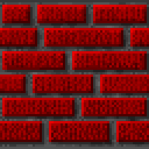
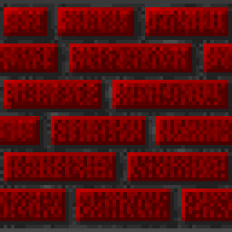

Reading Walls 3: Wolfenstien
============================

Etch-a-sketch maps are cool but I think it's time to add a little bit more.  Going further will likely require merging the functionality of map-reader and wad-reader so that we can add the visuals.  But as a baby step let's keep going with Wolfenstien, after all this is going to be the easy case.  To get Wolfenstien assets we need to look into `VSWAP.{ext}`.

VSWAP
-----

`VSWAP` first starts with a header with the following info:

```
chunksInFile (16-bits)
spriteStart (16-bits)
soundStart (16-bits)
offsets (chunksInFile * 32-bits)
lengths (chunksInFile * 16-bits)
```

`chunksInFile` is the number of assets with a "chunk" being similar to a WAD "lump."  `spriteStart` and `soundStart` are indicies that tell us where the data of each type starts.  Note that there are actually 3 types: wall, sprite and sound.  Walls start immediate after the header and we can tell this because all the data from 0 to `spriteStart` has a length of 4096 (64*64 bitmap).  So let's say I want index `234`: if 234 > `spriteStart` but less than `soundStart` I know it's a sprite.  

Next are the 2 arrays with length and offsets, not unlike how planes were defined in the `GAMEMAP` file.  There are `chunksInFile` entries for each and each corrisponds to it's offset and length in the file.  With this we know the location, length and type of each entry.

We can lay these out in a table like we did with the WAD.  First we'll do the walls since they are easy.  It's the same as ROTT walls, a 64 x 64 bitmap with a 256 color palette.  Where does the palette come from?  It turns out that it gets embedded direcly in the executable.  The source code contains a file call `GAMEPAL.obj` which gets linked in when it's built and this contains the palette data.  Since this is not a game file, I'm not going to make this part of our asset reader.  So instead we'll just extract the data.  I've created a seperate tool under `tools` called [extract-palette.html](../tools/extract-palette.html).  This lets you load in the `GAMEPAL` file and it will extract the data.  Note that I have no idea how the obj file is setup, apparently there are a lot of versions of this extension.  I don't want to deal with that if I don't have to so I loaded it in a hex editor.  I like https://hexed.it/ because it's a really cool PWA.  The palette has already been extracted numerous times by others, so we actually know what the data looks like.  It starts black (#000000), medium blue (#a80000), medium green (#00a800), medium cyan (#a8a800) etc.  We won't find those values in the file.  Fishing around for more info I found a note about the colors being in the range of 0-64 (related to some hardware limitation I'm sure).  In actuality we need to divide each color by 4 so the sequence starts #000000, #0000a2, #00a200, #00a2a2 etc.  We can find this starts at byte index 119.  From there it's reading in the bytes for each color channel, multiplying them by 4 (left shift 2) and we have a full 256 color palette same as Doom or ROTT except there is just one for the entire game (Spear of Destiny has more than one for title and ending screens, perhaps we'll look at that later).


The final purple color indicates transparency and is not actually displayed but I have yet to see a place where it's used.

The extractor also dumps out the colors as an array of 3-value tuples, which is how we'll represent colors internally.  We just copy and paste this into the `wolf-utils.js` file.  The results:




Each wall has 2 variants a normal and dark one and they are right next to each other in the `VSWAP` file.  This is used to create faux lighting. Depending on whether a wall runs north/south or east/west it will get a different variant.

Refactor with internal formats
------------------------------

Along with the visual aids described below, it became obvious we can start simplifying.  Right now we have `rott-image`, `doom-image` and `rott-wall`.  Rather than add another `wolf-wall` and `wolf-image` it makes more sense to start carrying around these things in a standard representation.  The new `index-bitmap` will take care of rendering anything in this format.  To keep it simple, images will be a 2D array of rows, then columns.  Each value in the array will be an index and you must also give `index-bitmap` the palette.  We can have other renderers too.  For example, the `palette-extractor` and `TROOA1.html` output as tables instead so we get nice gridlines and can overlay data.

palettes too will get their own format which is a single array of 3-value tuples as explained above.  Then we can combine all the image custom elements and just worry about the algorithms to unpack them.

For now, I'm just using normal arrays but it's likely they could switch to Uint8 arrays. The reason besides a marginal savings in memory is that in the future we might start adding some WASM code.  Since WASM modules deal directly with blocks of bytes this will be an easier representation to pass around.  Today is not that day though.

Aside: Visual Aids
------------------

I create a visual aide for sprites located in `visual-aids` directory.  This was mainly copying the `doom-image` code and instead of exporting a canvas image, I built it into a table where I can add overlays and other fancy stuff if necessary.  That component is called `table-pic`. To make things simpler I also exported the binary lumps for the `PLAYPAL` palettes and `TROOA1` image.  `table-pic` takes in the url of both as attributes and fetches them.  It then renders the image and adds handy guides and indicies to make it easier to follow.

I'll probably start doing some more visual aides but I'm not sure what exactly.  Probably anything I, myself, have trouble visualizing, especially when I come back to it.

Also, here's the code snippet I used to export the lumps:

```js
window.dvToFile = function dvtoFile(dataView, length, offset = 0, name){
    length = length ?? dataView.byteLength;
    const blob = new Blob([dataView.buffer.slice(offset + dataView.byteOffset, offset + dataView.byteOffset + length)]);
    const url = URL.createObjectURL(blob);
    const a = document.createElement("a");
    a.href = url;
    a.download = name ?? "asset";
    a.click();
}
```
This operates on `DataViews`s which is why there's some extra offsetting.  A data view is just a view into an array buffer but we need the acutal array buffer to build the file.  So we grab the dataView's offset on the arraybuffer plus any offset from there as well as the length if necessary.  A trick to download files with js is to construct a link with the download attribute and programatically click it.  So what I do is use the debugger to stop at the start of the code generating the image and use this snippet to download the binary data.  I don't need a real tool to do this yet.

Notes:
------

- For some reason my `doom-image` component got corrupted and was never working in all chapters. Remember when I said had to skip over the padding bytes? Apparently it never made it to the repo.
- `allocBlockArray` had a bug reading from the wrong dimension.  Since the previous blocks were square it didn't matter but I fixed it while making the visual aids for images.  I also added the ability to preallocate a default value.
- `ted-asset.js` was added.  This contains functions for taking ted style assets and converting them into useful intermediate formats.
- I created `image-utils.js`.  This currently contains the code to take a index bitmap and convert it to an canvas image.
- `wolf-utils.js` has utilites for Wolfenstien files.  Right now that's just the palette.

Sources:
-------
- https://hexed.it/
- https://devinsmith.net/backups/bruce/wolf3d.html
- http://gaarabis.free.fr/_sites/specs/files/wlspec_APA.html
- https://www.gamasutra.com/view/news/344672/How_id_built_Wolfenstein_3D_using_Commander_Keen_tech.php